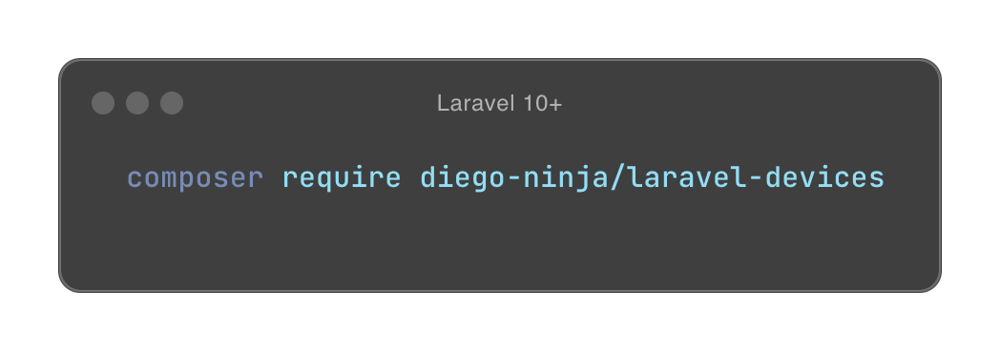

    

Laravel Devices is a comprehensive package for managing user devices and sessions in Laravel applications. It provides robust device tracking, session management, and security features including device fingerprinting and two-factor authentication support.

This is a work in progress, and maybe or maybe not be ready for production use.  Help is needed to improve the project and write documentation so if you are interested in contributing, please read the [contributing guide](./docs/contributing.md).

## ❤️ Features

* Authenticated User Devices
* Session Management
  * Session blocking
  * Session locking (Google 2FA support for session locking)
  * Session location tracking
* Device verifying
* Custom id format for sessions and devices
* Application events
* Ready to use middleware, routes, controllers, dtos, value objects and resources
* Ready to use Google 2FA integration
* Cache support for devices, sessions, locations and user agents
* [FingerprintJS](https://github.com/fingerprintjs/fingerprintjs), [ClientJS](https://github.com/jackspirou/clientjs) and [ThumbmarkJS](https://www.thumbmarkjs.com/) integrations for device fingerprinting

## 🗓️ Planned features

* Device hijacking detection
* Livewire integrations for [Laravel Jetstream](https://jetstream.laravel.com/) and [Laravel Breeze](https://laravel.com/docs/11.x/starter-kits#laravel-breeze)
* [Laravel Pulse](https://laravel.com/docs/11.x/pulse) integration

## 📚 Documentation

Please refer to the [documentation](./docs/README.md) for more information on the features and how to use this package.

## 🙏 Credits

This project is developed and maintained by 🥷 [Diego Rin](https://diego.ninja) and [Davide Pizzato](https://github.com/dvdpzzt-kimia) in their free time.

Special thanks to:

- [Laravel Framework](https://laravel.com/) for providing the most exciting and well-crafted PHP framework.
- [Hamed Mehryar](https://github.com/hamedmehryar) for developing the [inital code](https://github.com/hamedmehryar/laravel-session-tracker) that serves Laravel Devices as starting point.
- All the contributors and testers who have helped to improve this project through their contributions.

If you find this project useful, please consider giving it a ⭐ on GitHub!
