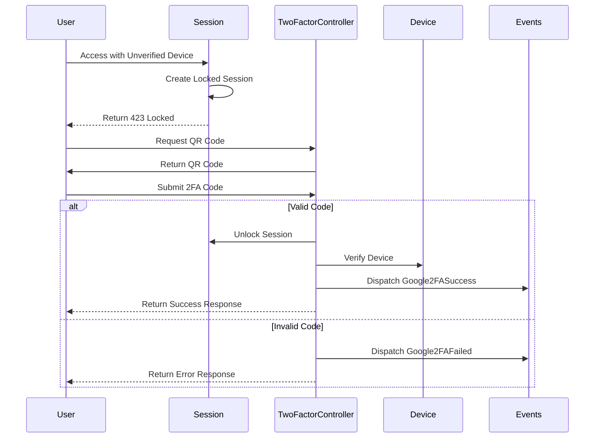

# Two-Factor Authentication

## Overview

Laravel Devices includes built-in support for Google Two-Factor Authentication (2FA). This feature provides an additional layer of security by requiring users to verify unverified devices using authenticator apps like Google Authenticator, Authy, or similar TOTP-based applications.

## Authentication Flow



## Basic Configuration

### Configuration File

```php
// config/devices.php
return [
    // Enable/Disable 2FA globally
    'google_2fa_enabled' => true,
    
    // Number of intervals to check (window * 30 seconds)
    'google_2fa_window' => 1,
    
    // Company name for QR code
    'google_2fa_company' => env('APP_NAME', 'Your Company'),
    
    // QR code format (base64 or svg)
    'google_2fa_qr_format' => 'base64',
    
    // Route name for 2FA verification
    'google_2fa_route_name' => 'app.2fa',
];
```

### User Model Setup

```php
use Ninja\DeviceTracker\Traits\Has2FA;

class User extends Authenticatable
{
    use Has2FA;
    
    // ... rest of your model
}
```

## Implementation

### Enable 2FA for User

```php
// Via Controller
public function enable2FA(Request $request)
{
    $user = $request->user();
    
    // Enable 2FA with new secret
    $user->enable2fa(
        app(Google2FA::class)->generateSecretKey()
    );
    
    // Get QR code for setup
    $qrCode = $user->google2faQrCode();
    
    return response()->json([
        'message' => '2FA enabled successfully',
        'qr_code' => $qrCode
    ]);
}
```

### Verify 2FA Code

```php
// Via Controller
public function verify2FA(Request $request)
{
    $user = $request->user();
    $code = $request->input('code');
    
    try {
        $valid = app(Google2FA::class)
            ->verifyKeyNewer(
                $user->google2fa->secret(),
                $code,
                $user->google2fa->last_success_at?->timestamp ?? 0
            );
            
        if ($valid !== false) {
            $user->google2fa->success();
            event(new Google2FASuccess($user));
            
            // Session and device are automatically unlocked/verified
            return response()->json([
                'message' => '2FA verification successful'
            ]);
        }
    } catch (\Exception $e) {
        report($e);
    }
    
    event(new Google2FAFailed($user));
    return response()->json([
        'message' => '2FA verification failed'
    ], 400);
}
```

### Disable 2FA

```php
// Via Controller
public function disable2FA(Request $request)
{
    $user = $request->user();
    
    if (!$user->google2faEnabled()) {
        return response()->json([
            'message' => '2FA is not enabled'
        ], 400);
    }
    
    $user->google2fa->disable();
    
    return response()->json([
        'message' => '2FA disabled successfully'
    ]);
}
```

## QR Code Generation

### Base64 Format

```php
// Generate base64 QR code
public function getQRCode(): string
{
    return $user->google2faQrCode('base64');
}

// Usage in view

```

### SVG Format

```php
// Generate SVG QR code
public function getQRCode(): string
{
    return $user->google2faQrCode('SVG');
}

// Usage in view
<div class="qr-code">
    {!! $qrCode !!}
</div>
```

## Session Integration

### Check Session Lock Status

```php
if ($session->locked()) {
    // Redirect to 2FA verification
    return redirect()->route(config('devices.google_2fa_route_name'));
}
```

### Automatic Session/Device Verification

```php
// This happens automatically after successful 2FA verification
$session->unlock();           // Unlock session
$session->device->verify();   // Verify device
```

## Events

### Available Events

```php
use Ninja\DeviceTracker\Events\Google2FASuccess;
use Ninja\DeviceTracker\Events\Google2FAFailed;

// Success event listener
class Handle2FASuccess
{
    public function handle(Google2FASuccess $event)
    {
        $user = $event->user;
        
        // Log successful verification
        Log::info('2FA verification successful', [
            'user_id' => $user->id,
            'device' => $user->device->uuid
        ]);
        
        // Additional actions...
    }
}

// Failure event listener
class Handle2FAFailure
{
    public function handle(Google2FAFailed $event)
    {
        $user = $event->user;
        
        // Log failed attempt
        Log::warning('2FA verification failed', [
            'user_id' => $user->id,
            'device' => $user->device->uuid
        ]);
        
        // Additional security measures...
    }
}
```

## Security Best Practices

### 1. Recovery Codes

```php
class TwoFactorRecovery
{
    public function generateRecoveryCodes(): array
    {
        $codes = [];
        for ($i = 0; $i < 8; $i++) {
            $codes[] = Str::random(10);
        }
        
        // Store hashed codes
        $hashedCodes = array_map(fn($code) => 
            hash('sha256', $code), 
            $codes
        );
        
        // Save to user metadata
        $user->metadata->set('2fa_recovery_codes', $hashedCodes);
        $user->save();
        
        return $codes; // Show to user once
    }
    
    public function useRecoveryCode(string $code): bool
    {
        $hashedCode = hash('sha256', $code);
        $codes = $user->metadata->get('2fa_recovery_codes', []);
        
        if (in_array($hashedCode, $codes)) {
            // Remove used code
            $codes = array_diff($codes, [$hashedCode]);
            $user->metadata->set('2fa_recovery_codes', $codes);
            $user->save();
            
            return true;
        }
        
        return false;
    }
}
```

### 2. Rate Limiting

```php
// In controller
public function verify(Request $request)
{
    $key = '2fa_attempts_'.$request->user()->id;
    
    if (RateLimiter::tooManyAttempts($key, 5)) {
        $seconds = RateLimiter::availableIn($key);
        
        return response()->json([
            'message' => "Too many attempts. Try again in {$seconds} seconds."
        ], 429);
    }
    
    RateLimiter::hit($key, 300); // Block for 5 minutes
    
    // Verification logic...
}
```

### 3. Device Verification Tracking

```php
class DeviceVerificationTracker
{
    public function trackVerification(Device $device, User $user): void
    {
        $device->metadata->set('2fa_verifications', [
            'last_verified_at' => now()->timestamp,
            'verified_from_ip' => request()->ip(),
            'user_id' => $user->id
        ]);
        
        $device->save();
    }
    
    public function getVerificationHistory(Device $device): array
    {
        return $device->metadata->get('2fa_verifications', []);
    }
}
```

## Frontend Integration Example

```javascript
// 2FA verification component
const TwoFactorVerification = {
    data() {
        return {
            code: '',
            loading: false,
            error: null
        }
    },
    
    methods: {
        async verify() {
            this.loading = true;
            this.error = null;
            
            try {
                const response = await axios.post('/api/2fa/verify', {
                    code: this.code
                });
                
                // Redirect on success
                window.location.href = '/dashboard';
            } catch (error) {
                this.error = error.response.data.message;
            } finally {
                this.loading = false;
            }
        }
    }
}
```

## Next Steps

- Review [Session Management](session-management.md)
- Explore [Device Fingerprinting](fingerprinting.md)
- Check [API Reference](api-reference.md)