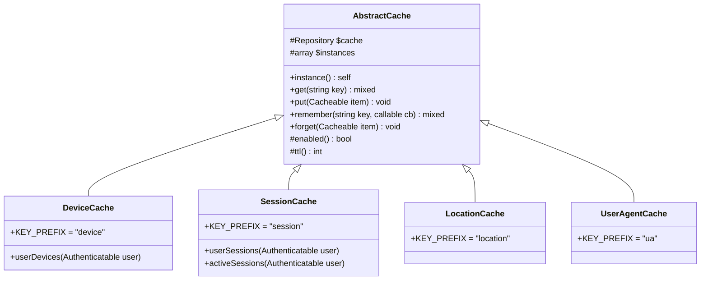

# Caching System

## Overview

Laravel Devices implements a flexible caching system to optimize performance. The package provides specialized cache handlers for devices, sessions, locations, and user agents, each with configurable TTL and storage options.

## Cache Architecture



## Basic Configuration

### Cache Settings

```php
// config/devices.php
return [
    // Enable cache for specific entities
    'cache_enabled_for' => ['device', 'location', 'session', 'ua'],
    
    // Cache store to use
    'cache_store' => 'redis', // recommended
    
    // TTL for each cache type (in seconds)
    'cache_ttl' => [
        'session' => 3600,        // 1 hour
        'device' => 3600,         // 1 hour
        'location' => 2592000,    // 30 days
        'ua' => 2592000,         // 30 days
    ],
];
```

## Cache Types

### Device Cache

```php
use Ninja\DeviceTracker\Cache\DeviceCache;

// Get device from cache
$device = DeviceCache::get($deviceUuid);

// Store device in cache
DeviceCache::put($device);

// Get user devices with caching
$devices = DeviceCache::userDevices($user);

// Forget device cache
DeviceCache::forget($device);

// Remember pattern
$device = DeviceCache::remember($key, function() {
    return Device::where('uuid', $uuid)->first();
});
```

### Session Cache

```php
use Ninja\DeviceTracker\Cache\SessionCache;

// Get all user sessions with caching
$sessions = SessionCache::userSessions($user);

// Get only active sessions
$activeSessions = SessionCache::activeSessions($user);

// Remember pattern for custom queries
$session = SessionCache::remember($key, function() {
    return Session::with('device')->find($id);
});

// Forget session cache
SessionCache::forget($session);
```

### Location Cache

```php
use Ninja\DeviceTracker\Cache\LocationCache;

// Cache location data
$location = LocationCache::remember($ip, function() use ($ip) {
    return $this->locationProvider->locate($ip);
});

// Example implementation with location provider
class CachedLocationProvider implements LocationProvider
{
    public function locate(string $ip): Location
    {
        return LocationCache::remember(
            sprintf('%s:%s', LocationCache::KEY_PREFIX, $ip),
            fn() => $this->provider->locate($ip)
        );
    }
}
```

### User Agent Cache

```php
use Ninja\DeviceTracker\Cache\UserAgentCache;

// Cache user agent parsing
$userAgent = UserAgentCache::remember($key, function() {
    return $this->parser->parse($userAgentString);
});
```

## Cache Implementation

### Cacheable Interface

```php
interface Cacheable
{
    public function key(): string;
    public function ttl(): ?int;
}

// Example implementation
class Device extends Model implements Cacheable
{
    public function key(): string
    {
        return sprintf('%s:%s', DeviceCache::KEY_PREFIX, $this->uuid);
    }
    
    public function ttl(): ?int
    {
        return config('devices.cache_ttl')[DeviceCache::KEY_PREFIX];
    }
}
```

### Custom Cache Implementation

```php
class CustomCache extends AbstractCache
{
    public const KEY_PREFIX = 'custom';
    
    protected function enabled(): bool
    {
        return in_array(self::KEY_PREFIX, 
            config('devices.cache_enabled_for', []));
    }
    
    public static function customRemember(string $key, callable $callback)
    {
        if (!self::instance()->enabled()) {
            return $callback();
        }
        
        return self::instance()->cache->remember(
            self::KEY_PREFIX . ':' . $key,
            self::instance()->ttl(),
            $callback
        );
    }
}
```

## Performance Optimization

### Cache Tags

```php
// Using cache tags with Redis
class TaggedDeviceCache extends DeviceCache
{
    public static function userDevices(Authenticatable $user)
    {
        if (!self::instance()->enabled()) {
            return $user->devices;
        }
        
        return self::instance()->cache
            ->tags(['devices', "user:{$user->id}"])
            ->remember(
                "user:devices:{$user->id}", 
                self::instance()->ttl(),
                fn() => $user->devices
            );
    }
    
    public static function flushUserDevices(Authenticatable $user)
    {
        self::instance()->cache
            ->tags(["user:{$user->id}"])
            ->flush();
    }
}
```

### Batch Operations

```php
class BatchCacheOperations
{
    public function refreshDeviceCaches(Collection $devices): void
    {
        $devices->each(function ($device) {
            DeviceCache::forget($device);
            DeviceCache::put($device);
        });
    }
    
    public function warmUpCache(): void
    {
        // Pre-cache frequently accessed devices
        Device::where('status', DeviceStatus::Verified)
            ->chunk(100, function ($devices) {
                $this->refreshDeviceCaches($devices);
            });
    }
}
```

## Cache Maintenance

### Automatic Cache Cleanup

```php
class CacheMaintenanceJob implements ShouldQueue
{
    public function handle(): void
    {
        // Clean old location caches
        $this->cleanLocationCache();
        
        // Clean inactive session caches
        $this->cleanSessionCache();
        
        // Refresh active device caches
        $this->refreshActiveDeviceCaches();
    }
    
    private function cleanLocationCache(): void
    {
        // Implementation
    }
    
    private function cleanSessionCache(): void
    {
        // Implementation
    }
    
    private function refreshActiveDeviceCaches(): void
    {
        // Implementation
    }
}
```

### Cache Monitoring

```php
class CacheMonitor
{
    public function getCacheStats(): array
    {
        return [
            'devices' => [
                'count' => $this->getDeviceCacheCount(),
                'hit_rate' => $this->getHitRate(DeviceCache::KEY_PREFIX),
                'memory' => $this->getCacheMemoryUsage(DeviceCache::KEY_PREFIX)
            ],
            'sessions' => [
                'count' => $this->getSessionCacheCount(),
                'hit_rate' => $this->getHitRate(SessionCache::KEY_PREFIX),
                'memory' => $this->getCacheMemoryUsage(SessionCache::KEY_PREFIX)
            ],
            // ... other cache types
        ];
    }
    
    private function getHitRate(string $prefix): float
    {
        // Implementation
    }
    
    private function getCacheMemoryUsage(string $prefix): int
    {
        // Implementation
    }
}
```

## Best Practices

### 1. Cache Invalidation

```php
class CacheInvalidator
{
    public function invalidateUserRelatedCaches(User $user): void
    {
        // Invalidate device caches
        $user->devices->each(function ($device) {
            DeviceCache::forget($device);
        });
        
        // Invalidate session caches
        $user->sessions->each(function ($session) {
            SessionCache::forget($session);
        });
        
        // Clear user-specific caches
        Cache::tags(["user:{$user->id}"])->flush();
    }
}
```

### 2. Cache Warmup

```php
class CacheWarmer
{
    public function warmDeviceCaches(): void
    {
        // Cache verified devices
        Device::where('status', DeviceStatus::Verified)
            ->chunk(100, function ($devices) {
                $devices->each(fn($device) => 
                    DeviceCache::put($device)
                );
            });
    }
    
    public function warmLocationCaches(): void
    {
        // Cache common locations
        Session::select('ip')
            ->distinct()
            ->chunk(100, function ($sessions) {
                $sessions->each(fn($session) =>
                    LocationCache::remember(
                        $session->ip,
                        fn() => $this->getLocation($session->ip)
                    )
                );
            });
    }
}
```

### 3. Error Handling

```php
class CacheErrorHandler
{
    public function handle(\Exception $e): void
    {
        if ($e instanceof \Predis\Connection\ConnectionException) {
            // Fallback to array cache
            Config::set('devices.cache_store', 'array');
            
            // Log incident
            Log::error('Redis connection failed, using array cache', [
                'exception' => $e->getMessage()
            ]);
        }
    }
}
```

## Next Steps

- Review [API Reference](api-reference.md)
- Explore [Events System](events.md)
- Check [Performance Optimization](performance.md)