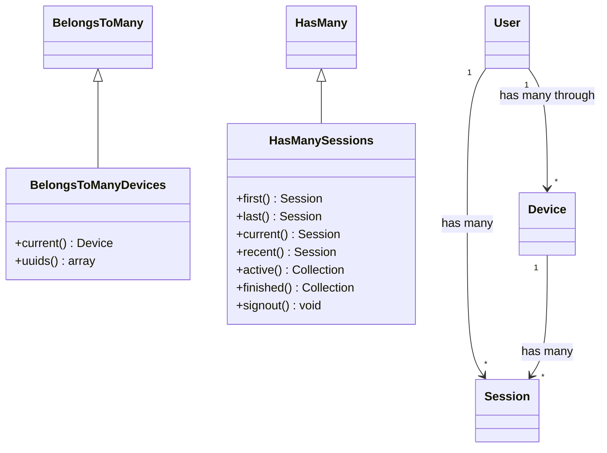

# Database Schema and Relations

## Overview

Laravel Devices utilizes a custom relational structure with specialized relationship classes for enhanced device and session management. The schema includes support for devices, sessions, user relationships, and two-factor authentication.

## Custom Relations



### BelongsToManyDevices

Extends Laravel's `BelongsToMany` relation to provide specialized device management functionality.

```php
use Ninja\DeviceTracker\Models\Relations\BelongsToManyDevices;

// In User model
public function devices(): BelongsToManyDevices
{
    $instance = $this->newRelatedInstance(Device::class);

     return new BelongsToManyDevices(
         query: $instance->newQuery(),
         parent: $this,
         table: 'device_sessions',
         foreignPivotKey: 'user_id',
         relatedPivotKey: 'device_uuid',
         parentKey: 'id',
         relatedKey: 'uuid',
     );
}

// Usage examples
$user->devices()->current(); // Get current device
$deviceUuids = $user->devices()->uuids(); // Get all device UUIDs
```

Key Features:
- `current()`: Returns the currently active device
- `uuids()`: Returns an array of device UUIDs

### HasManySessions

Extends Laravel's `HasMany` relation to provide enhanced session management capabilities.

```php
use Ninja\DeviceTracker\Models\Relations\HasManySessions;

// In Device model
public function sessions(): HasManySessions
{
    return new HasManySessions(
        Session::query(),
        $this,
        'device_uuid',
        'uuid'
    );
}

// Usage examples
$device->sessions()->current(); // Get current session
$device->sessions()->active(); // Get all active sessions
$device->sessions()->recent(); // Get most recent session
$device->sessions()->signout(); // End all sessions
```

Key Features:
- `first()`: Get first session
- `last()`: Get last session
- `current()`: Get current active session
- `recent()`: Get most recent session
- `active()`: Get all active sessions
- `finished()`: Get completed sessions
- `signout()`: End all active sessions

## Database Tables

### devices

```php
Schema::create('devices', function (Blueprint $table) {
    $table->increments('id');
    $table->string('uuid')->unique();
    $table->string('fingerprint')->unique()->nullable();
    $table->string('status')->default(DeviceStatus::Unverified->value);
    $table->string('browser')->nullable();
    $table->string('browser_family')->nullable();
    $table->string('browser_version')->nullable();
    $table->string('browser_engine')->nullable();
    $table->string('platform')->nullable();
    $table->string('platform_family')->nullable();
    $table->string('platform_version')->nullable();
    $table->string('device_type')->nullable();
    $table->string('device_family')->nullable();
    $table->string('device_model')->nullable();
    $table->string('grade')->nullable();
    $table->string('source')->nullable();
    $table->string('ip');
    $table->json('metadata')->nullable();
    $table->timestamps();
    $table->timestamp('verified_at')->nullable();
    $table->timestamp('hijacked_at')->nullable();
});
```

### device_sessions

```php
Schema::create('device_sessions', function (Blueprint $table) {
    $table->increments('id');
    $table->string('uuid')->unique();
    $table->integer('user_id');
    $table->string('device_uuid');
    $table->string('ip')->nullable();
    $table->json('location')->nullable();
    $table->string('status')->default(SessionStatus::Active->value);
    $table->json('metadata')->nullable();
    $table->timestamp('started_at')->nullable();
    $table->timestamp('finished_at')->nullable();
    $table->timestamp('last_activity_at')->nullable();
    $table->timestamp('blocked_at')->nullable();
    $table->timestamp('unlocked_at')->nullable();
    $table->integer('blocked_by')->nullable();
});
```

### user_devices (Pivot)

```php
Schema::create($this->table(), function (Blueprint $table) {
    $table->id();
    $table->bigInteger($this->field())->unsigned();
    $table->string('device_uuid');
    $table->timestamps();
    $table->foreign($this->field())
        ->references('id')
        ->on(config('devices.authenticatable_table'))
        ->onDelete('cascade');
    $table->foreign('device_uuid')
        ->references('uuid')
        ->on('devices')
        ->onDelete('cascade');
});
```

## Common Query Patterns

### Device Queries

```php
// Get user's verified devices
$verifiedDevices = $user->devices()
    ->where('status', DeviceStatus::Verified)
    ->get();

// Get current device with active sessions
$currentDevice = $user->devices()
    ->current()
    ->with(['sessions' => function($query) {
        $query->where('status', SessionStatus::Active);
    }])
    ->first();

// Get devices by location
$devicesInLocation = $user->devices()
    ->whereHas('sessions', function($query) use ($country) {
        $query->whereRaw("JSON_EXTRACT(location, '$.country') = ?", [$country]);
    })
    ->get();
```

### Session Queries

```php
// Get all active sessions for a device
$activeSessions = $device->sessions()
    ->active()
    ->with('user')
    ->get();

// Get recent sessions with location
$recentSessions = $device->sessions()
    ->recent()
    ->whereNotNull('location')
    ->limit(5)
    ->get();

// End inactive sessions
$device->sessions()
    ->where('last_activity_at', '<', now()->subHours(24))
    ->each(function($session) {
        $session->end();
    });
```

## Event Integration

Both custom relations integrate with the package's event system:

```php
// Sessions events
$device->sessions()->active()->each(function($session) {
    event(new SessionEndedEvent($session));
});

// Device events
$user->devices()->each(function($device) {
    event(new DeviceVerifiedEvent($device, $user));
});
```

## Using Metadata

Both devices and sessions support metadata storage:

```php
// Store device metadata
$device->metadata->set('last_verified_location', [
    'ip' => $request->ip(),
    'location' => $session->location->toString()
]);

// Store session metadata
$session->metadata->set('authentication_method', '2fa');
$session->metadata->set('security_level', 'high');
```

## Best Practices

1. **Relationship Usage**
   ```php
   // Prefer custom relation methods over raw queries
   // Good
   $currentDevice = $user->devices()->current();
   
   // Avoid
   $currentDevice = $user->devices()
       ->where('uuid', device_uuid())
       ->first();
   ```

2. **Session Management**
   ```php
   // Use built-in methods for session management
   // Good
   $device->sessions()->signout();
   
   // Avoid
   $device->sessions()->each->end();
   ```

3. **Query Optimization**
   ```php
   // Load relationships efficiently
   $devices = $user->devices()
       ->with(['sessions' => function($query) {
           $query->recent()->limit(5);
       }])
       ->get();
   ```

## Next Steps

- Review [Device Management](device-management.md)
- Explore [Session Management](session-management.md)
- Learn about [Events System](events.md)