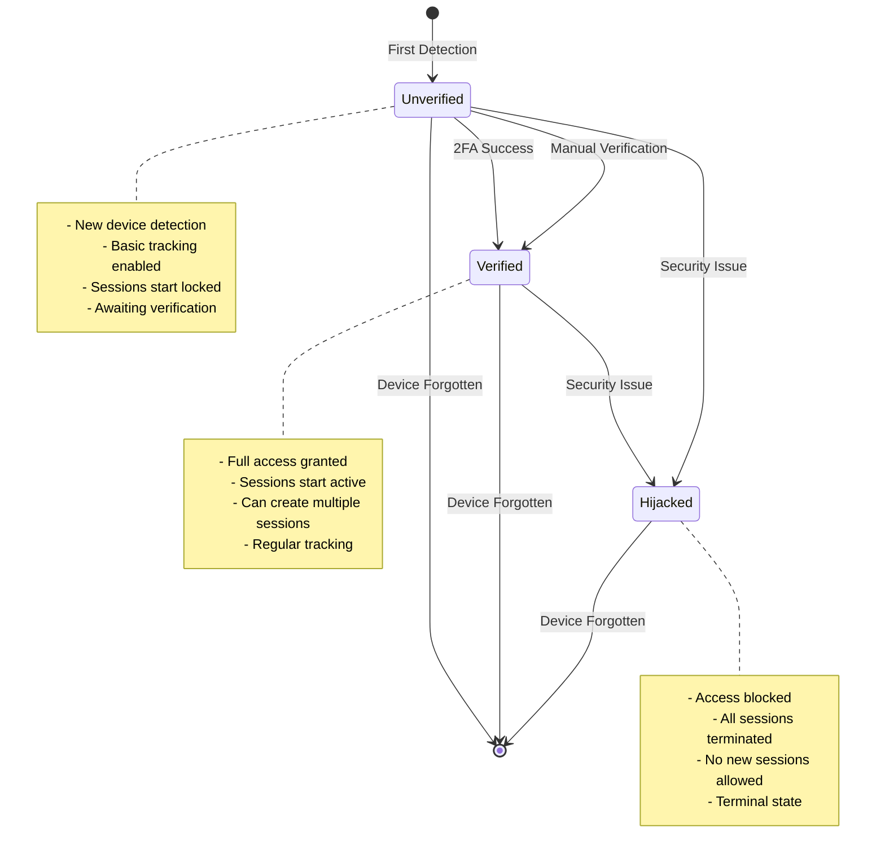
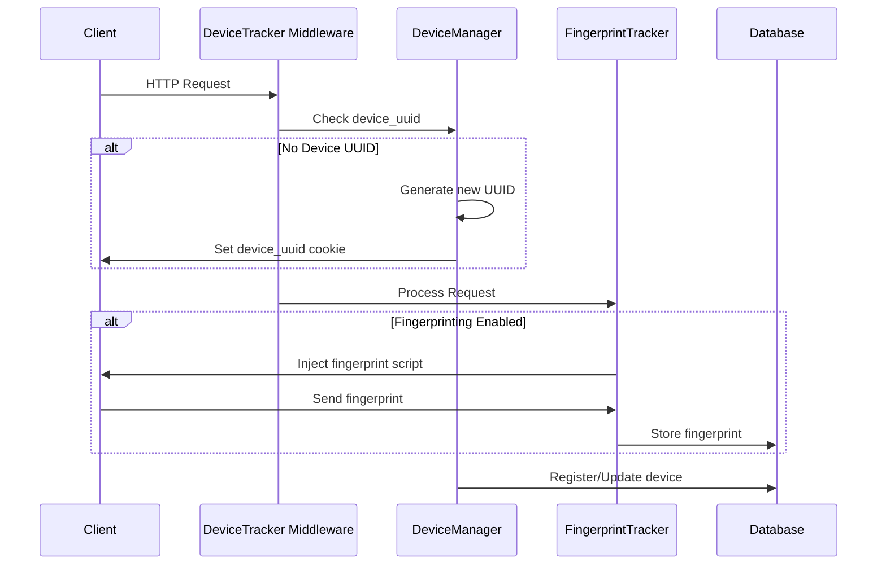

# Device Management

## Overview

Device management is a core feature of Laravel Devices that handles device tracking, verification, and lifecycle management. This document details how devices are tracked, managed, and secured.

## Device Lifecycle



## Device Detection Flow



## Basic Device Management

### Tracking New Devices

```php
use Ninja\DeviceTracker\Facades\DeviceManager;

// Automatically track current device
$device = DeviceManager::track();

// Check if device is already tracked
if (DeviceManager::tracked()) {
    $device = DeviceManager::current();
}

// Get device by UUID
$device = Device::byUuid($uuid);

// Get device by fingerprint
$device = Device::byFingerprint($fingerprint);
```

### Device Status Management

```php
// Verify a device
$device->verify();

// Check verification status
if ($device->verified()) {
    // Process secured request
}

// Mark device as hijacked
$device->hijack();

// Check if device is hijacked
if ($device->hijacked()) {
    // Block access
}

// Remove device and all its sessions
$device->forget();
```

## Device Information

### Basic Device Information

```php
$device = DeviceManager::current();

// Get device details
echo $device->browser;           // "Chrome"
echo $device->browser_version;   // "91.0.4472.124"
echo $device->platform;          // "Windows"
echo $device->device_type;       // "Desktop"
echo $device->ip;               // "192.168.1.1"

// Get device label
echo $device->label();          // "Windows Desktop Chrome"

// Check if device is current
if ($device->isCurrent()) {
    // This is the device making the request
}
```

### Device Metadata

```php
// Add metadata to device
$device->metadata->set('last_login_country', 'ES');
$device->metadata->set('trusted', true);
$device->save();

// Retrieve metadata
$country = $device->metadata->get('last_login_country');
$trusted = $device->metadata->get('trusted');

// Check if metadata exists
if ($device->metadata->has('trusted')) {
    // Process trusted device
}
```

## Advanced Device Management

### Custom Device Registration

```php
use Ninja\DeviceTracker\DTO\Device as DeviceDTO;use Ninja\DeviceTracker\Modules\Detection\DTO\Browser;use Ninja\DeviceTracker\Modules\Detection\DTO\DeviceType;use Ninja\DeviceTracker\Modules\Detection\DTO\Platform;

// Create device data
$deviceData = new DeviceDTO(
    browser: new Browser(
        name: 'Chrome',
        version: Version::fromString('91.0.4472.124'),
        family: 'Chrome',
        engine: 'Blink',
        type: 'browser'
    ),
    platform: new Platform(
        name: 'Windows',
        version: Version::fromString('10.0'),
        family: 'Windows'
    ),
    device: new DeviceType(
        family: 'Desktop',
        model: 'PC',
        type: 'desktop'
    ),
    ip: '192.168.1.1',
    grade: null,
    userAgent: 'Mozilla/5.0...'
);

// Register device
$device = Device::register($deviceUuid, $deviceData);
```

### Device Sessions Management

```php
// Get all device sessions
$sessions = $device->sessions;

// Get active sessions
$activeSessions = $device->sessions()
    ->where('status', SessionStatus::Active)
    ->get();

// End all device sessions
$device->sessions->each(function ($session) {
    $session->end();
});
```

### Device-User Relationships

```php
// Get device users
$users = $device->users;

// Check if user owns device
if ($device->users->contains($user)) {
    // User owns this device
}

// Add device to user
$user->devices()->attach($device);

// Remove device from user
$user->devices()->detach($device);
```

## Security Features

### Device Verification

```php
// Manual verification
$device->verify($user);

// Verify through 2FA
$device->session()->unlock();
$device->verify();

// Add verification metadata
$device->metadata->set('verified_by', 'admin');
$device->metadata->set('verification_reason', 'trusted location');
$device->save();
```

### Hijacking Protection

```php
// Mark device as hijacked
$device->hijack($user);

// Add hijacking metadata
$device->metadata->set('hijack_reason', 'suspicious_activity');
$device->metadata->set('hijacked_from_ip', '192.168.1.1');
$device->save();

// Block all sessions
$device->sessions->each(function ($session) {
    $session->block();
});
```

## Events

Device management triggers various events that you can listen for:

```php
use Ninja\DeviceTracker\Events\DeviceAttachedEvent;
use Ninja\DeviceTracker\Events\DeviceVerifiedEvent;
use Ninja\DeviceTracker\Events\DeviceHijackedEvent;

// In your EventServiceProvider
protected $listen = [
    DeviceAttachedEvent::class => [
        SendDeviceNotification::class,
    ],
    DeviceVerifiedEvent::class => [
        LogDeviceVerification::class,
    ],
    DeviceHijackedEvent::class => [
        NotifySecurityTeam::class,
    ],
];
```

## Best Practices

1. **Device Verification**
    - Always verify devices through secure channels
    - Use 2FA when possible
    - Log verification attempts

```php
// Example verification with logging
public function verifyDevice(Device $device, User $user)
{
    try {
        $device->verify($user);
        Log::info('Device verified', [
            'device_uuid' => $device->uuid,
            'user_id' => $user->id,
            'ip' => request()->ip()
        ]);
        return true;
    } catch (\Exception $e) {
        Log::error('Device verification failed', [
            'device_uuid' => $device->uuid,
            'error' => $e->getMessage()
        ]);
        return false;
    }
}
```

2. **Security Monitoring**
    - Track device usage patterns
    - Monitor location changes
    - React to suspicious activity

```php
// Example security monitor
public function monitorDevice(Device $device)
{
    $suspiciousActivity = false;
    
    // Check location changes
    $currentIP = request()->ip();
    $lastIP = $device->ip;
    
    if ($currentIP !== $lastIP) {
        $locationChanged = true;
        // Check if location change is suspicious
        if ($this->isLocationChangeSuspicious($lastIP, $currentIP)) {
            $suspiciousActivity = true;
        }
    }
    
    // React to suspicious activity
    if ($suspiciousActivity) {
        $device->hijack();
        event(new SuspiciousActivityDetected($device));
    }
}
```

3. **Device Cleanup**
    - Regularly clean up unused devices
    - Archive device history
    - Maintain device metadata

```php
// Example cleanup job
public function cleanupDevices()
{
    Device::where('last_activity_at', '<', now()->subMonths(6))
        ->where('status', '!=', DeviceStatus::Hijacked)
        ->each(function ($device) {
            // Archive device data
            $this->archiveDeviceData($device);
            // Remove device
            $device->forget();
        });
}
```

## Next Steps

- Learn about [Session Management](session-management.md)
- Configure [Device Fingerprinting](fingerprinting.md)
- Implement [Two-Factor Authentication](2fa.md)