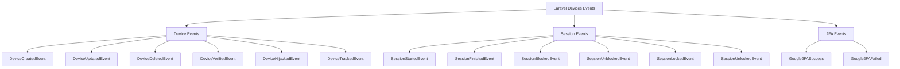

# Events System

## Overview

Laravel Devices provides a comprehensive event system that allows you to monitor and react to various device, session, and authentication activities. These events can be used for logging, monitoring, notifications, and integration with other systems.

## Event Categories



## Device Events

### DeviceCreatedEvent

Fired when a new device is registered in the system.

```php
use Ninja\DeviceTracker\Events\DeviceCreatedEvent;

class DeviceCreatedListener
{
    public function handle(DeviceCreatedEvent $event)
    {
        $device = $event->device;
        $user = $event->user;
        
        // Example: Send notification about new device
        $user->notify(new NewDeviceRegistered($device));
        
        // Example: Log device creation
        Log::info('New device registered', [
            'device_uuid' => $device->uuid,
            'user_id' => $user->id,
            'browser' => $device->browser,
            'platform' => $device->platform,
            'ip' => $device->ip
        ]);
    }
}
```

### DeviceVerifiedEvent

Triggered when a device is verified, either manually or through 2FA.

```php
use Ninja\DeviceTracker\Events\DeviceVerifiedEvent;

class DeviceVerifiedListener
{
    public function handle(DeviceVerifiedEvent $event)
    {
        $device = $event->device;
        $user = $event->user;
        
        // Example: Record verification details
        $device->metadata->set('verification_details', [
            'verified_at' => now()->toIso8601String(),
            'verified_by' => $user->id,
            'verification_ip' => request()->ip()
        ]);
        
        $device->save();
    }
}
```

### DeviceHijackedEvent

Fired when a device is marked as potentially compromised.

```php
use Ninja\DeviceTracker\Events\DeviceHijackedEvent;

class DeviceHijackedListener
{
    public function handle(DeviceHijackedEvent $event)
    {
        $device = $event->device;
        $user = $event->user;
        
        // Example: Alert security team
        SecurityTeam::alert([
            'type' => 'device_hijacked',
            'device_uuid' => $device->uuid,
            'user_id' => $user->id,
            'timestamp' => now(),
            'location' => $device->sessions->last()->location
        ]);
        
        // Example: Send emergency notification
        $user->notify(new DeviceCompromisedNotification($device));
    }
}
```

## Session Events

### SessionStartedEvent

Triggered when a new session is created.

```php
use Ninja\DeviceTracker\Events\SessionStartedEvent;

class SessionStartedListener
{
    public function handle(SessionStartedEvent $event)
    {
        $session = $event->session;
        $user = $event->user;
        
        // Example: Log session start with location
        Log::info('Session started', [
            'session_uuid' => $session->uuid,
            'user_id' => $user->id,
            'device_uuid' => $session->device_uuid,
            'location' => $session->location->toString(),
            'ip' => $session->ip
        ]);
        
        // Example: Check for concurrent sessions
        $activeSessions = $user->sessions()
            ->active()
            ->count();
            
        if ($activeSessions > 5) {
            // Alert about multiple active sessions
            $user->notify(new MultipleSessions($activeSessions));
        }
    }
}
```

### SessionBlockedEvent

Fired when a session is blocked due to security concerns.

```php
use Ninja\DeviceTracker\Events\SessionBlockedEvent;

class SessionBlockedListener
{
    public function handle(SessionBlockedEvent $event)
    {
        $session = $event->session;
        $user = $event->user;
        
        // Example: Record security incident
        SecurityIncident::create([
            'type' => 'session_blocked',
            'user_id' => $user->id,
            'session_uuid' => $session->uuid,
            'device_uuid' => $session->device_uuid,
            'location' => $session->location,
            'metadata' => [
                'blocked_at' => now()->toIso8601String(),
                'blocked_by' => $session->blocked_by,
                'previous_status' => $session->getOriginal('status')
            ]
        ]);
    }
}
```

## 2FA Events

### Google2FASuccess

Triggered when 2FA verification is successful.

```php
use Ninja\DeviceTracker\Events\Google2FASuccess;

class Google2FASuccessListener
{
    public function handle(Google2FASuccess $event)
    {
        $user = $event->user;
        
        // Example: Log successful verification
        Log::info('2FA verification successful', [
            'user_id' => $user->id,
            'device' => $user->device->uuid,
            'timestamp' => now()
        ]);
        
        // Example: Record successful verification
        $user->google2fa->metadata = array_merge(
            $user->google2fa->metadata ?? [],
            ['last_successful_verification' => [
                'timestamp' => now()->toIso8601String(),
                'ip' => request()->ip(),
                'device_uuid' => $user->device->uuid
            ]]
        );
        
        $user->google2fa->save();
    }
}
```

### Google2FAFailed

Fired when 2FA verification fails.

```php
use Ninja\DeviceTracker\Events\Google2FAFailed;

class Google2FAFailedListener
{
    public function handle(Google2FAFailed $event)
    {
        $user = $event->user;
        
        // Example: Monitor failed attempts
        Cache::increment("2fa_failures:{$user->id}");
        
        // Example: Alert on multiple failures
        $failures = Cache::get("2fa_failures:{$user->id}");
        if ($failures >= 3) {
            $user->notify(new Multiple2FAFailures);
            SecurityTeam::alert([
                'type' => '2fa_multiple_failures',
                'user_id' => $user->id,
                'attempts' => $failures,
                'ip' => request()->ip()
            ]);
        }
    }
}
```

## Registering Event Listeners

### EventServiceProvider

```php
use Illuminate\Foundation\Support\Providers\EventServiceProvider as ServiceProvider;

class EventServiceProvider extends ServiceProvider
{
    protected $listen = [
        // Device Events
        DeviceCreatedEvent::class => [
            SendNewDeviceNotification::class,
            LogDeviceCreation::class,
        ],
        DeviceHijackedEvent::class => [
            AlertSecurityTeam::class,
            BlockDeviceSessions::class,
        ],
        
        // Session Events
        SessionStartedEvent::class => [
            LogSessionStart::class,
            CheckConcurrentSessions::class,
        ],
        SessionBlockedEvent::class => [
            RecordSecurityIncident::class,
            NotifyUserOfBlockedSession::class,
        ],
        
        // 2FA Events
        Google2FASuccess::class => [
            LogSuccessful2FA::class,
            UpdateDeviceVerification::class,
        ],
        Google2FAFailed::class => [
            Monitor2FAFailures::class,
            AlertOnMultipleFailures::class,
        ],
    ];
}
```

## Example Implementation Patterns

### Security Monitoring System

```php
class SecurityMonitoringSystem
{
    public function handleDeviceEvent($event)
    {
        $device = $event->device;
        $user = $event->user;
        
        // Record event
        SecurityLog::create([
            'event_type' => class_basename($event),
            'device_uuid' => $device->uuid,
            'user_id' => $user->id,
            'metadata' => [
                'ip' => request()->ip(),
                'location' => $device->sessions->last()->location,
                'timestamp' => now()->toIso8601String()
            ]
        ]);
        
        // Check for suspicious patterns
        if ($this->detectSuspiciousPattern($device)) {
            $this->triggerSecurityAlert($device, $user);
        }
    }
    
    protected function detectSuspiciousPattern($device)
    {
        // Implementation
    }
    
    protected function triggerSecurityAlert($device, $user)
    {
        // Implementation
    }
}
```

### Audit System

```php
class AuditSystem
{
    public function logSessionEvent($event)
    {
        $session = $event->session;
        
        AuditLog::create([
            'event' => class_basename($event),
            'session_uuid' => $session->uuid,
            'device_uuid' => $session->device_uuid,
            'user_id' => $session->user_id,
            'details' => [
                'ip' => $session->ip,
                'location' => $session->location->toString(),
                'status' => $session->status,
                'metadata' => $session->metadata
            ]
        ]);
    }
}
```

## Best Practices

1. **Event Handling**
    - Keep event listeners focused and single-purpose
    - Avoid heavy processing in synchronous listeners
    - Use queued listeners for time-consuming tasks
    - Handle exceptions properly

2. **Security Considerations**
    - Log security-related events comprehensively
    - Implement rate limiting for sensitive operations
    - Monitor patterns of suspicious activity
    - Alert appropriate personnel for critical events

3. **Performance**
    - Use queued listeners for non-critical operations
    - Avoid heavy database queries in listeners
    - Cache frequently accessed data
    - Clean up old event logs regularly

## Next Steps

- Review [API Documentation](api-reference.md)
- Explore [Security Best Practices](security.md)
- Learn about [Custom Implementation](custom-ids.md)