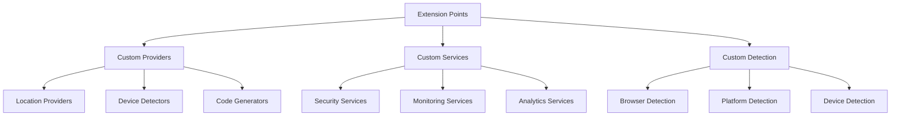

# Extending Laravel Devices

## Overview

Laravel Devices is designed to be extensible, allowing you to customize and extend its functionality to meet your specific needs. This guide covers various extension points and provides examples of common customization scenarios.

## Extension Points



## Custom Location Provider

### Implementing a Custom Location Provider

```php
use Ninja\DeviceTracker\Modules\Location\Contracts\LocationProvider;use Ninja\DeviceTracker\Modules\Location\DTO\Location;

class MaxMindLocationProvider implements LocationProvider
{
    private $reader;
    private Location $location;
    
    public function __construct()
    {
        $this->reader = new \MaxMind\Db\Reader(
            storage_path('maxmind/GeoLite2-City.mmdb')
        );
    }
    
    public function locate(string $ip): Location
    {
        $record = $this->reader->get($ip);
        
        $this->location = Location::fromArray([
            'ip' => $ip,
            'country' => $record['country']['iso_code'],
            'region' => $record['subdivisions'][0]['names']['en'],
            'city' => $record['city']['names']['en'],
            'postal' => $record['postal']['code'],
            'latitude' => (string)$record['location']['latitude'],
            'longitude' => (string)$record['location']['longitude'],
            'timezone' => $record['location']['time_zone']
        ]);
        
        return $this->location;
    }
    
    public function country(): string
    {
        return $this->location->country;
    }
    
    public function region(): string
    {
        return $this->location->region;
    }
    
    public function city(): string
    {
        return $this->location->city;
    }
    
    // Implement other interface methods...
}
```

### Registering Custom Provider

```php
use Illuminate\Support\ServiceProvider;use Ninja\DeviceTracker\Modules\Location\Contracts\LocationProvider;

class CustomProvidersServiceProvider extends ServiceProvider
{
    public function register(): void
    {
        $this->app->bind(LocationProvider::class, function ($app) {
            return new MaxMindLocationProvider();
        });
    }
}
```

## Custom Device Detector

### Implementing Device Detector

```php
use DeviceDetector\ClientHints;use Ninja\DeviceTracker\DTO\Device;use Ninja\DeviceTracker\Modules\Detection\Contracts\DeviceDetector;use Ninja\DeviceTracker\Modules\Detection\DTO\Browser;

class EnhancedDeviceDetector implements DeviceDetector
{
    private $detector;
    
    public function __construct()
    {
        $this->detector = new \DeviceDetector\DeviceDetector();
    }
    
    public function detect(Request $request): Device
    {
        $userAgent = $request->header('User-Agent');
        $clientHints = ClientHints::factory($_SERVER);
        
        $this->detector->setUserAgent($userAgent);
        $this->detector->setClientHints($clientHints);
        $this->detector->parse();
        
        return new Device(
            browser: $this->detectBrowser(),
            platform: $this->detectPlatform(),
            device: $this->detectDevice(),
            ip: $request->ip(),
            grade: $this->calculateDeviceGrade(),
            userAgent: $userAgent
        );
    }
    
    private function detectBrowser(): Browser
    {
        $client = $this->detector->getClient();
        
        return new Browser(
            name: $client['name'],
            version: Version::fromString($client['version']),
            family: $client['family'],
            engine: $client['engine'],
            type: $client['type']
        );
    }
    
    // Implement other detection methods...
    
    private function calculateDeviceGrade(): string
    {
        // Custom grading logic
        $score = 0;
        
        // Browser factors
        $score += $this->getBrowserScore();
        
        // Platform factors
        $score += $this->getPlatformScore();
        
        // Security factors
        $score += $this->getSecurityScore();
        
        return match(true) {
            $score >= 90 => 'A',
            $score >= 80 => 'B',
            $score >= 70 => 'C',
            default => 'D'
        };
    }
}
```

## Custom Analytics Service

### Implementation

```php
class DeviceAnalyticsService
{
    public function analyzeUserDevices(User $user): array
    {
        $devices = $user->devices;
        
        return [
            'total_devices' => $devices->count(),
            'device_types' => $this->analyzeDeviceTypes($devices),
            'browser_stats' => $this->analyzeBrowsers($devices),
            'platform_stats' => $this->analyzePlatforms($devices),
            'location_stats' => $this->analyzeLocations($devices),
            'activity_patterns' => $this->analyzeActivityPatterns($devices)
        ];
    }
    
    private function analyzeDeviceTypes(Collection $devices): array
    {
        return $devices->groupBy('device_type')
            ->map(fn($group) => [
                'count' => $group->count(),
                'percentage' => $group->count() / $devices->count() * 100
            ])
            ->toArray();
    }
    
    private function analyzeActivityPatterns(Collection $devices): array
    {
        $patterns = [];
        
        foreach ($devices as $device) {
            $sessions = $device->sessions;
            
            $patterns[$device->uuid] = [
                'active_days' => $this->calculateActiveDays($sessions),
                'peak_hours' => $this->calculatePeakHours($sessions),
                'average_session_duration' => $this->calculateAverageSessionDuration($sessions),
                'location_consistency' => $this->calculateLocationConsistency($sessions)
            ];
        }
        
        return $patterns;
    }
    
    // Additional analysis methods...
}
```

## Custom Security Service

### Enhanced Security Provider

```php
class EnhancedSecurityService
{
    private SecurityRateLimiter $rateLimiter;
    private DeviceAnalyticsService $analytics;
    
    public function assessDeviceTrust(Device $device): float
    {
        $factors = [
            $this->calculateAgeFactor($device),
            $this->calculateLocationFactor($device),
            $this->calculateActivityFactor($device),
            $this->calculateBehaviorFactor($device)
        ];
        
        return array_sum($factors) / count($factors);
    }
    
    public function detectAnomaly(Device $device): bool
    {
        $anomalyScore = 0;
        
        // Check location anomalies
        if ($this->hasLocationAnomaly($device)) {
            $anomalyScore += 0.4;
        }
        
        // Check behavior anomalies
        if ($this->hasBehaviorAnomaly($device)) {
            $anomalyScore += 0.3;
        }
        
        // Check pattern anomalies
        if ($this->hasPatternAnomaly($device)) {
            $anomalyScore += 0.3;
        }
        
        return $anomalyScore >= 0.7;
    }
    
    private function calculateAgeFactor(Device $device): float
    {
        $age = $device->created_at->diffInDays(now());
        
        return match(true) {
            $age > 180 => 1.0,  // 6+ months
            $age > 90 => 0.8,   // 3-6 months
            $age > 30 => 0.6,   // 1-3 months
            $age > 7 => 0.4,    // 1-7 days
            default => 0.2      // < 1 day
        };
    }
    
    // Additional security methods...
}
```

## Custom Event Handlers

### Extended Event Subscriber

```php
class ExtendedDeviceEventSubscriber
{
    private DeviceAnalyticsService $analytics;
    private EnhancedSecurityService $security;
    
    public function handleDeviceCreated(DeviceCreatedEvent $event): void
    {
        // Perform initial device analysis
        $analysis = $this->analytics->analyzeDevice($event->device);
        
        // Set initial trust score
        $trustScore = $this->security->assessDeviceTrust($event->device);
        
        // Store analytics
        $event->device->metadata->set('initial_analysis', $analysis);
        $event->device->metadata->set('trust_score', $trustScore);
        $event->device->save();
    }
    
    public function handleDeviceHijacked(DeviceHijackedEvent $event): void
    {
        // Perform forensic analysis
        $forensics = $this->security->performForensicAnalysis($event->device);
        
        // Store threat data
        ThreatLog::create([
            'device_uuid' => $event->device->uuid,
            'threat_type' => 'hijacking',
            'forensics' => $forensics,
            'detected_at' => now()
        ]);
        
        // Notify security team
        SecurityTeam::notifyOfThreat($event->device, $forensics);
    }
    
    // Additional event handlers...
}
```

## Integration Examples

### Custom Integration Service

```php
class DeviceIntegrationService
{
    public function syncWithMDM(Device $device): void
    {
        // Sync with Mobile Device Management system
        $mdmData = [
            'device_id' => $device->uuid,
            'status' => $device->status,
            'platform' => $device->platform,
            'last_seen' => $device->sessions->last()?->last_activity_at,
            'security_grade' => $device->grade
        ];
        
        MDMClient::syncDevice($mdmData);
    }
    
    public function syncWithSIEM(array $securityEvent): void
    {
        // Sync with Security Information and Event Management system
        SIEMClient::logSecurityEvent([
            'timestamp' => now()->toIso8601String(),
            'event_type' => $securityEvent['type'],
            'severity' => $securityEvent['severity'],
            'device_data' => $securityEvent['device'],
            'context' => $securityEvent['context']
        ]);
    }
}
```

## Best Practices

1. **Service Extension**
    - Keep services focused and single-responsibility
    - Use dependency injection
    - Implement proper interfaces
    - Add comprehensive logging

2. **Event Handling**
    - Create specific event listeners
    - Handle events asynchronously when possible
    - Implement proper error handling
    - Maintain event documentation

3. **Security**
    - Implement rate limiting
    - Validate all inputs
    - Log security-relevant events
    - Handle sensitive data properly

## Next Steps

- Review [API Documentation](api-reference.md)
- Explore [Security Features](security.md)
- Configure [Custom IDs](custom-ids.md)