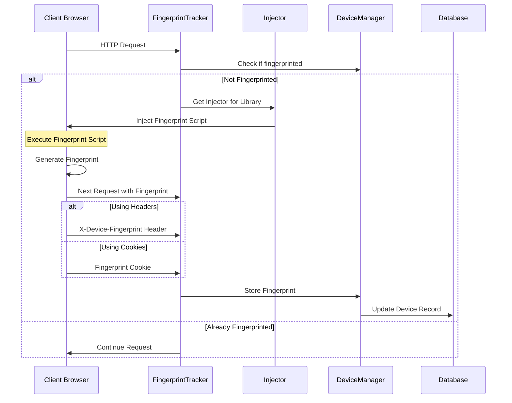

# Device Fingerprinting

## Overview

Laravel Devices supports device fingerprinting through two popular libraries: FingerprintJS (default) and ClientJS. This feature helps identify devices across sessions using browser and device characteristics.

## Fingerprinting Flow



## Basic Configuration

### Configuration File

```php
// config/devices.php
return [
    'fingerprinting_enabled' => true,
    'client_fingerprint_transport' => 'cookie', // or 'header'
    'client_fingerprint_key' => 'csf',
];
```

### Middleware Registration
To automatically try to fingerprint devices, add the `FingerprintTracker` middleware to the global middleware stack. This middleware checks if the device is fingerprinted and injects the fingerprinting script if needed. Must be added after the `DeviceTracker` middleware.

```php
// app/Http/Kernel.php
protected $middleware = [
    \Ninja\DeviceTracker\Http\Middleware\DeviceTracker::class,
    // ...
    \Ninja\DeviceTracker\Http\Middleware\FingerprintTracker::class,
];
```

## FingerprintJS Integration (Default)

### Basic Setup

```php
// config/devices.php
return [
    'fingerprinting_enabled' => true,
    'fingerprint_client_library' => \Ninja\DeviceTracker\Modules\Fingerprinting\Injector\Enums\Library::FingerprintJS,
];
```

### Generated Script

```javascript
// Automatically injected by FingerprintJSInjector
const fpPromise = import('https://openfpcdn.io/fingerprintjs/v4')
    .then(FingerprintJS => FingerprintJS.load())

fpPromise
    .then(fp => fp.get())
    .then(result => {
        const fingerprint = result.visitorId;
        
        // Store fingerprint based on configuration
        if (window.DeviceTracker.config.transport.type === 'header') {
            // Will be sent in next request
            window.DeviceTracker.config.current = fingerprint;
        } else {
            // Set as cookie
            document.cookie = `${window.DeviceTracker.config.transport.key}=${fingerprint}; expires=Fri, 31 Dec 9999 23:59:59 GMT; path=/`;
        }
    });
```

### Important Notes About FingerprintJS

```php
/**
 * Important notes:
 * 1. FingerprintJS is the default and recommended option
 * 2. Free for development and prototyping
 * 3. Requires paid license for production use
 * 4. Provides more accurate fingerprinting
 * 5. Regular updates and maintenance
 */
```

## ClientJS Integration

### Configuration

```php
// config/devices.php
return [
    'fingerprinting_enabled' => true,
    'fingerprint_client_library' => \Ninja\DeviceTracker\Modules\Fingerprinting\Injector\Enums\Library::ClientJS,
];
```

### Generated Script

```javascript
// Automatically injected by ClientJSInjector
if (window.DeviceTracker.config.current === null) {
    const client = new ClientJS();
    const fingerprint = client.getFingerprint();
    
    // Store fingerprint based on configuration
    window.DeviceTracker.config.current = fingerprint;
    
    if (window.DeviceTracker.config.transport.type === 'cookie') {
        document.cookie = `${window.DeviceTracker.config.transport.key}=${fingerprint}; expires=Fri, 31 Dec 9999 23:59:59 GMT; path=/`;
    }
}
```

### Important Notes About ClientJS

```php
/**
 * Important notes:
 * 1. Fully open-source alternative
 * 2. Free for all use cases
 * 3. Simpler fingerprinting algorithm
 * 4. Lighter weight
 * 5. Discontinued package. May require manual updates
 */
```

## Fingerprint Transport Methods

### Header Transport

```php
// Configuration
'client_fingerprint_transport' => 'header',
'client_fingerprint_key' => 'X-Device-Fingerprint',

// Generated headers in requests
X-Device-Fingerprint: f0a4d8c9e1b3f2a5
```

### Cookie Transport

```php
// Configuration
'client_fingerprint_transport' => 'cookie',
'client_fingerprint_key' => 'device_fingerprint',

// Generated cookie
document.cookie = 'csf=f0a4d8c9e1b3f2a5; path=/';
```

## Custom Implementation

### Custom Injector

```php
use Ninja\DeviceTracker\Modules\Fingerprinting\Injector\AbstractInjector;

class CustomInjector extends AbstractInjector
{
    public const LIBRARY_NAME = 'custom';
    public const LIBRARY_URL = 'https://your-custom-library.js';
    
    protected static function script(Device $device): string
    {
        return view('custom-fingerprint-script', [
            'current' => $device->fingerprint,
            'transport' => [
                'type' => config('devices.client_fingerprint_transport'),
                'key' => config('devices.client_fingerprint_key')
            ],
            'library' => [
                'name' => static::LIBRARY_NAME,
                'url' => static::LIBRARY_URL
            ]
        ])->render();
    }
}
```

### Custom Library Registration

```php
use Ninja\DeviceTracker\Modules\Fingerprinting\Injector\Factories\InjectorFactory;

// Register in service provider
public function register(): void
{
    $this->app->bind(Injector::class, function ($app) {
        return InjectorFactory::make(Library::Custom);
    });
}
```

## Working with Fingerprints

### Retrieving Fingerprints

```php
// Get current device fingerprint
$fingerprint = DeviceManager::current()->fingerprint;

// Find device by fingerprint
$device = Device::byFingerprint($fingerprint);

// Check if device is fingerprinted
if (DeviceManager::fingerprinted()) {
    // Device has fingerprint
}
```

### Fingerprint Validation

```php
class FingerprintValidator
{
    public function validate(string $fingerprint): bool
    {
        // Check format
        if (!preg_match('/^[a-f0-9]{32}$/', $fingerprint)) {
            return false;
        }
        
        // Check if fingerprint exists
        $device = Device::byFingerprint($fingerprint);
        if ($device) {
            // Validate device status
            return !$device->hijacked();
        }
        
        return true;
    }
}
```

## Security Considerations

### Fingerprint Reliability

```php
// Example fingerprint reliability check
public function isReliableFingerprint(Device $device): bool
{
    // Check fingerprint age
    $fingerprintAge = $device->updated_at->diffInDays(now());
    if ($fingerprintAge > 30) {
        return false;
    }
    
    // Check for fingerprint collisions
    $devicesWithSameFingerprint = Device::where('fingerprint', $device->fingerprint)
        ->where('uuid', '!=', $device->uuid)
        ->count();
        
    if ($devicesWithSameFingerprint > 0) {
        return false;
    }
    
    return true;
}
```

### Best Practices

1. **Regular Validation**
```php
// Implement regular fingerprint validation
public function validateFingerprints(): void
{
    Device::chunk(100, function ($devices) {
        foreach ($devices as $device) {
            if (!$this->isReliableFingerprint($device)) {
                // Reset fingerprint
                $device->fingerprint = null;
                $device->save();
                
                // Log incident
                Log::warning('Unreliable fingerprint detected', [
                    'device_uuid' => $device->uuid
                ]);
            }
        }
    });
}
```

2. **Fingerprint Updates**
```php
// Handle fingerprint updates
public function updateFingerprint(Device $device, string $newFingerprint): void
{
    // Store old fingerprint
    $oldFingerprint = $device->fingerprint;
    
    // Update fingerprint
    $device->fingerprint = $newFingerprint;
    $device->save();
    
    // Log change
    Log::info('Device fingerprint updated', [
        'device_uuid' => $device->uuid,
        'old_fingerprint' => $oldFingerprint,
        'new_fingerprint' => $newFingerprint
    ]);
}
```

## Next Steps

- Explore [Session Management](session-management.md)
- Configure [Two-Factor Authentication](2fa.md)
- Review [Security Best Practices](security.md)