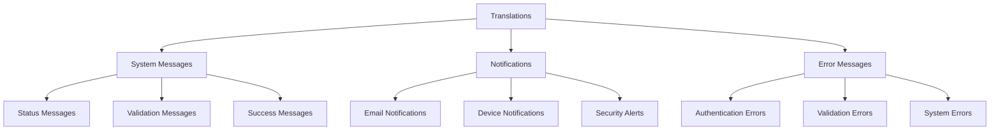

# Localization and Language Support

## Overview

Laravel Devices provides localization support for messages, notifications, and error handling. The package includes translations for multiple languages and allows for custom translations and regional settings.

## Translation Structure



## Language Files

### English (en)

```php
// lang/en/devices.php
return [
    'statuses' => [
        'verified' => 'Verified',
        'unverified' => 'Unverified',
        'hijacked' => 'Hijacked'
    ],
    
    'messages' => [
        'device' => [
            'created' => 'New device registered successfully',
            'verified' => 'Device verified successfully',
            'hijacked' => 'Device has been marked as compromised',
            'forgotten' => 'Device has been forgotten'
        ],
        
        'session' => [
            'started' => 'Session started successfully',
            'ended' => 'Session ended successfully',
            'blocked' => 'Session has been blocked',
            'locked' => 'Session is locked',
            'inactive' => 'Session is inactive'
        ],
        
        '2fa' => [
            'enabled' => 'Two-factor authentication enabled',
            'disabled' => 'Two-factor authentication disabled',
            'verified' => 'Two-factor authentication verified successfully',
            'failed' => 'Two-factor authentication failed'
        ]
    ],
    
    'notifications' => [
        'device' => [
            'new_device' => [
                'subject' => 'New Device Login',
                'line1' => 'A new device was used to access your account.',
                'line2' => 'If this was not you, please secure your account immediately.'
            ],
            'device_hijacked' => [
                'subject' => 'Security Alert - Device Compromised',
                'line1' => 'Your device has been marked as potentially compromised.',
                'line2' => 'All sessions from this device have been terminated.'
            ]
        ]
    ],
    
    'errors' => [
        'device_not_found' => 'Device not found',
        'session_not_found' => 'Session not found',
        'invalid_2fa_code' => 'Invalid authentication code',
        'session_expired' => 'Your session has expired',
        'device_blocked' => 'This device has been blocked'
    ]
];
```

### Spanish (es)

```php
// lang/es/devices.php
return [
    'statuses' => [
        'verified' => 'Verificado',
        'unverified' => 'No verificado',
        'hijacked' => 'Comprometido'
    ],
    
    'messages' => [
        'device' => [
            'created' => 'Nuevo dispositivo registrado exitosamente',
            'verified' => 'Dispositivo verificado exitosamente',
            'hijacked' => 'El dispositivo ha sido marcado como comprometido',
            'forgotten' => 'El dispositivo ha sido olvidado'
        ],
        
        'session' => [
            'started' => 'Sesión iniciada exitosamente',
            'ended' => 'Sesión finalizada exitosamente',
            'blocked' => 'La sesión ha sido bloqueada',
            'locked' => 'La sesión está bloqueada',
            'inactive' => 'La sesión está inactiva'
        ],
        
        '2fa' => [
            'enabled' => 'Autenticación de dos factores activada',
            'disabled' => 'Autenticación de dos factores desactivada',
            'verified' => 'Autenticación de dos factores verificada exitosamente',
            'failed' => 'Fallo en la autenticación de dos factores'
        ]
    ]
    // ... rest of translations
];
```

## Using Translations

### In Controllers

```php
class DeviceController extends Controller
{
    public function verify(Request $request, string $uuid)
    {
        $device = Device::byUuidOrFail($uuid);
        $device->verify();
        
        return response()->json([
            'message' => __('devices.messages.device.verified')
        ]);
    }
    
    public function hijack(Request $request, string $uuid)
    {
        $device = Device::byUuidOrFail($uuid);
        $device->hijack();
        
        return response()->json([
            'message' => __('devices.messages.device.hijacked')
        ]);
    }
}
```

### In Notifications

```php
class NewDeviceNotification extends Notification
{
    public function toMail($notifiable): MailMessage
    {
        return (new MailMessage)
            ->subject(__('devices.notifications.device.new_device.subject'))
            ->line(__('devices.notifications.device.new_device.line1'))
            ->line(__('devices.notifications.device.new_device.line2'))
            ->action(
                __('devices.notifications.device.new_device.action'),
                url('/devices')
            );
    }
}
```

### In Exception Handling

```php
class DeviceNotFoundException extends Exception
{
    public static function withDevice(StorableId $uuid): self
    {
        return new self(__('devices.errors.device_not_found'));
    }
}
```

## Middleware for Language Detection

```php
class LocaleMiddleware
{
    public function handle(Request $request, Closure $next)
    {
        // Check if user has a preferred language
        if ($user = $request->user()) {
            app()->setLocale($user->preferred_language ?? config('app.locale'));
            return $next($request);
        }
        
        // Check Accept-Language header
        $locale = $request->getPreferredLanguage(config('devices.supported_locales'));
        app()->setLocale($locale);
        
        return $next($request);
    }
}
```

## Custom Language Support

### Adding New Languages

```php
// config/devices.php
return [
    'supported_locales' => [
        'en' => 'English',
        'es' => 'Español',
        'fr' => 'Français',
        'de' => 'Deutsch'
    ],
    
    'fallback_locale' => 'en'
];
```

### Language Manager

```php
class LanguageManager
{
    public function getSupportedLocales(): array
    {
        return config('devices.supported_locales', []);
    }
    
    public function isLocaleSupported(string $locale): bool
    {
        return array_key_exists($locale, $this->getSupportedLocales());
    }
    
    public function setUserLocale(User $user, string $locale): void
    {
        if (!$this->isLocaleSupported($locale)) {
            throw new UnsupportedLocaleException($locale);
        }
        
        $user->update(['preferred_language' => $locale]);
    }
}
```

## Location Formatting

### Address Formatter

```php
class AddressFormatter
{
    public function formatLocation(Location $location, string $locale): string
    {
        return match($locale) {
            'en' => $this->formatEnglish($location),
            'es' => $this->formatSpanish($location),
            default => $this->formatDefault($location)
        };
    }
    
    private function formatEnglish(Location $location): string
    {
        return sprintf(
            '%s, %s, %s %s',
            $location->city,
            $location->region,
            $location->country,
            $location->postal
        );
    }
    
    private function formatSpanish(Location $location): string
    {
        return sprintf(
            '%s %s, %s, %s',
            $location->postal,
            $location->city,
            $location->region,
            $location->country
        );
    }
}
```

## Regional Settings

### DateTime Formatting

```php
class DateTimeFormatter
{
    public function format(Carbon $datetime, string $locale): string
    {
        $formats = [
            'en' => 'M j, Y g:i A',
            'es' => 'd/m/Y H:i',
            'de' => 'd.m.Y H:i',
            'fr' => 'd/m/Y H:i'
        ];
        
        return $datetime->format(
            $formats[$locale] ?? $formats[config('devices.fallback_locale')]
        );
    }
}
```

## Testing Translations

```php
class TranslationTest extends TestCase
{
    /** @test */
    public function it_returns_correct_translations_for_different_locales()
    {
        $supportedLocales = config('devices.supported_locales');
        
        foreach ($supportedLocales as $locale => $name) {
            app()->setLocale($locale);
            
            $this->assertNotEmpty(__('devices.messages.device.created'));
            $this->assertNotEmpty(__('devices.messages.device.verified'));
            $this->assertNotEmpty(__('devices.errors.device_not_found'));
        }
    }
    
    /** @test */
    public function it_formats_locations_correctly_for_different_locales()
    {
        $location = new Location([
            'city' => 'Madrid',
            'region' => 'Madrid',
            'country' => 'ES',
            'postal' => '28001'
        ]);
        
        $formatter = new AddressFormatter();
        
        $this->assertEquals(
            'Madrid, Madrid, ES 28001',
            $formatter->formatLocation($location, 'en')
        );
        
        $this->assertEquals(
            '28001 Madrid, Madrid, ES',
            $formatter->formatLocation($location, 'es')
        );
    }
}
```

## Best Practices

1. **Translation Management**
    - Keep translations organized
    - Use translation keys consistently
    - Provide fallback translations
    - Document translation keys

2. **Regional Considerations**
    - Support multiple date formats
    - Consider address formats
    - Handle number formatting
    - Support RTL languages

3. **Maintenance**
    - Keep translations up to date
    - Validate translation completeness
    - Review translations periodically
    - Document regional differences

## Next Steps

- Review [API Documentation](api-reference.md)
- Explore [Customization](custom-ids.md)
- Configure [Notifications](notifications.md)