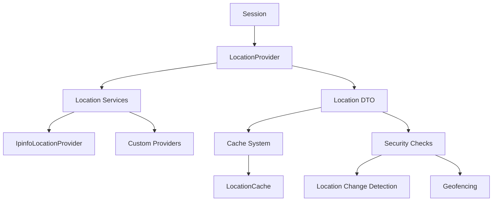

# Location Tracking

## Overview

Laravel Devices includes a robust location tracking system for sessions, which helps in monitoring session activity and detecting potential security threats based on geographical patterns.

## Architecture



## Location Provider Contract

```php
interface LocationProvider
{
    public function country(): string;
    public function region(): string;
    public function city(): string;
    public function postal(): string;
    public function latitude(): ?string;
    public function longitude(): ?string;
    public function timezone(): ?string;
    public function locate(string $ip): Location;
}
```

## Default Implementation (IpinfoLocationProvider)

```php
class IpinfoLocationProvider implements LocationProvider
{
    private const API_URL = "https://ipinfo.io/%s/json";
    private Location $location;
    
    public function locate(string $ip): Location
    {
        $key = sprintf('%s:%s', LocationCache::KEY_PREFIX, $ip);
        
        return LocationCache::remember($key, function () use ($ip) {
            $url = sprintf(self::API_URL, $ip);
            $locationData = json_decode(file_get_contents($url), true);
            
            [$lat, $long] = explode(",", $locationData['loc']);
            
            $locationData['latitude'] = $lat;
            $locationData['longitude'] = $long;
            
            $this->location = Location::fromArray($locationData);
            
            return $this->location;
        });
    }
    
    public function country(): string
    {
        return $this->location->country;
    }
    
    // Implementation of other interface methods...
}
```

## Creating Custom Location Providers

### Example: MaxMind GeoIP2 Provider

```php
use GeoIp2\Database\Reader;
use Ninja\DeviceTracker\Contracts\LocationProvider;
use Ninja\DeviceTracker\DTO\Location;

class MaxMindLocationProvider implements LocationProvider
{
    private Reader $reader;
    private Location $location;
    
    public function __construct()
    {
        $this->reader = new Reader(
            storage_path('geoip/GeoLite2-City.mmdb')
        );
    }
    
    public function locate(string $ip): Location
    {
        return LocationCache::remember(
            "location:$ip", 
            fn() => $this->performLookup($ip)
        );
    }
    
    private function performLookup(string $ip): Location
    {
        $record = $this->reader->city($ip);
        
        $this->location = Location::fromArray([
            'ip' => $ip,
            'country' => $record->country->isoCode,
            'region' => $record->mostSpecificSubdivision->name,
            'city' => $record->city->name,
            'postal' => $record->postal->code,
            'latitude' => (string)$record->location->latitude,
            'longitude' => (string)$record->location->longitude,
            'timezone' => $record->location->timeZone
        ]);
        
        return $this->location;
    }
    
    // Implementation of other interface methods...
}
```

### Example: Fallback Provider with Multiple Services

```php
class FallbackLocationProvider implements LocationProvider
{
    private array $providers;
    private Location $location;
    
    public function __construct()
    {
        $this->providers = [
            new IpinfoLocationProvider(),
            new MaxMindLocationProvider(),
            new IpApiLocationProvider()
        ];
    }
    
    public function locate(string $ip): Location
    {
        foreach ($this->providers as $provider) {
            try {
                $this->location = $provider->locate($ip);
                return $this->location;
            } catch (\Exception $e) {
                Log::warning("Location provider failed", [
                    'provider' => get_class($provider),
                    'ip' => $ip,
                    'error' => $e->getMessage()
                ]);
                continue;
            }
        }
        
        throw new LocationLookupFailedException($ip);
    }
    
    // Implementation of other interface methods...
}
```

## Registering Custom Providers

```php
// In a service provider
public function register(): void
{
    $this->app->bind(LocationProvider::class, function ($app) {
        return new MaxMindLocationProvider();
        
        // Or use the fallback provider
        // return new FallbackLocationProvider();
    });
}
```

## Location Data Transfer Object

```php
final readonly class Location implements JsonSerializable, Stringable, Cacheable
{
    public function __construct(
        public ?string $ip,
        public ?string $hostname,
        public ?string $country,
        public ?string $region,
        public ?string $city,
        public ?string $postal,
        public ?string $latitude,
        public ?string $longitude,
        public ?string $timezone
    ) {}
    
    public static function fromArray(array $location): self
    {
        return new self(
            ip: $location['ip'] ?? null,
            hostname: $location['hostname'] ?? null,
            country: $location['country'] ?? null,
            region: $location['region'] ?? null,
            city: $location['city'] ?? null,
            postal: $location['postal'] ?? null,
            latitude: $location['latitude'] ?? null,
            longitude: $location['longitude'] ?? null,
            timezone: $location['timezone'] ?? null
        );
    }
    
    public function toString(): string
    {
        return sprintf(
            '%s %s, %s, %s',
            $this->postal,
            $this->city,
            $this->region,
            $this->country
        );
    }
}
```

## Location Analysis and Security

### Location Change Detection

```php
class LocationChangeDetector
{
    private const MAX_DISTANCE_KM = 1000;
    private const MAX_SPEED_KMH = 1000; // Maximum plausible speed
    
    public function detectSuspiciousChange(
        Session $currentSession,
        Session $previousSession
    ): bool {
        if (!$previousSession) {
            return false;
        }
        
        $distance = $this->calculateDistance(
            $currentSession->location,
            $previousSession->location
        );
        
        $timeDiff = $currentSession->created_at->diffInHours(
            $previousSession->created_at
        );
        
        // Check if travel speed is plausible
        if ($timeDiff > 0) {
            $speed = $distance / $timeDiff;
            if ($speed > self::MAX_SPEED_KMH) {
                return true;
            }
        }
        
        return false;
    }
    
    private function calculateDistance(
        Location $loc1,
        Location $loc2
    ): float {
        // Haversine formula implementation
    }
}
```

### Geofencing

```php
class GeofenceManager
{
    private array $allowedCountries = ['ES', 'FR', 'PT'];
    private array $restrictedRegions = ['KP', 'XK'];
    
    public function isLocationAllowed(Location $location): bool
    {
        // Check country restrictions
        if (in_array($location->country, $this->restrictedRegions)) {
            return false;
        }
        
        // Check if country is in allowed list
        if (!empty($this->allowedCountries) && 
            !in_array($location->country, $this->allowedCountries)) {
            return false;
        }
        
        return true;
    }
}
```

## Caching Location Data

```php
class LocationCache extends AbstractCache
{
    public const KEY_PREFIX = 'location';
    private const DEFAULT_TTL = 86400; // 24 hours
    
    protected function enabled(): bool
    {
        return in_array(self::KEY_PREFIX, 
            config('devices.cache_enabled_for', []));
    }
    
    public static function remember(string $key, callable $callback)
    {
        if (!self::instance()->enabled()) {
            return $callback();
        }
        
        return Cache::remember(
            self::key($key),
            self::instance()->ttl(),
            $callback
        );
    }
}
```

## Usage Examples

### Basic Location Tracking

```php
// In SessionManager
public function start(): Session
{
    $device = DeviceManager::current();
    
    $location = app(LocationProvider::class)
        ->locate(request()->ip());
        
    $session = Session::create([
        'device_uuid' => $device->uuid,
        'ip' => request()->ip(),
        'location' => $location,
        // Other session data...
    ]);
    
    return $session;
}
```

### Location-Based Security

```php
class LocationBasedSecurity
{
    private LocationChangeDetector $detector;
    private GeofenceManager $geofence;
    
    public function validateSessionLocation(Session $session): bool
    {
        // Check geofencing rules
        if (!$this->geofence->isLocationAllowed($session->location)) {
            event(new SuspiciousLocationDetected($session));
            return false;
        }
        
        // Check for suspicious location changes
        $previousSession = $session->user->sessions()
            ->where('id', '!=', $session->id)
            ->orderByDesc('created_at')
            ->first();
            
        if ($this->detector->detectSuspiciousChange($session, $previousSession)) {
            event(new SuspiciousLocationChangeDetected($session, $previousSession));
            return false;
        }
        
        return true;
    }
}
```

## Best Practices

1. **Error Handling**
   ```php
   try {
       $location = $provider->locate($ip);
   } catch (LocationLookupException $e) {
       Log::error('Location lookup failed', [
           'ip' => $ip,
           'error' => $e->getMessage()
       ]);
       
       // Use fallback provider or default location
       $location = $this->getFallbackLocation();
   }
   ```

2. **Cache Management**
   ```php
   // Implement cache warming for frequently accessed locations
   class LocationCacheWarmer
   {
       public function warm(): void
       {
           Session::select('ip')
               ->distinct()
               ->chunk(100, function ($sessions) {
                   foreach ($sessions as $session) {
                       LocationCache::remember(
                           "location:{$session->ip}",
                           fn() => $this->provider->locate($session->ip)
                       );
                   }
               });
       }
   }
   ```

3. **Location Data Privacy**
   ```php
   class LocationPrivacyManager
   {
       public function anonymizeLocation(Location $location): Location
       {
           return Location::fromArray([
               'country' => $location->country,
               'region' => $location->region,
               'city' => null,
               'postal' => null,
               'latitude' => null,
               'longitude' => null
           ]);
       }
   }
   ```

## Next Steps

- Review [Session Management](session-management.md)
- Explore [Security Features](security.md)
- Configure [Caching System](caching.md)