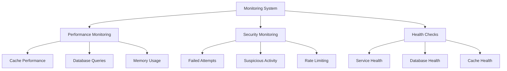

# Monitoring and Performance

## Overview

This guide covers monitoring, performance optimization, and maintenance of Laravel Devices implementations. It includes best practices for logging, monitoring, performance tuning, and system health checks.

## Monitoring Architecture



## Performance Monitoring

### Query Performance Monitor

```php
class QueryPerformanceMonitor
{
    public function register(): void
    {
        DB::listen(function($query) {
            $this->analyzeQuery($query);
        });
    }
    
    private function analyzeQuery($query): void
    {
        $time = $query->time;
        $sql = $query->sql;
        $bindings = $query->bindings;
        
        // Log slow queries
        if ($time > 100) { // 100ms threshold
            Log::warning('Slow query detected', [
                'sql' => $sql,
                'bindings' => $bindings,
                'time' => $time,
                'trace' => debug_backtrace(DEBUG_BACKTRACE_IGNORE_ARGS)
            ]);
        }
        
        // Track query patterns
        $this->trackQueryPattern($sql, $time);
    }
    
    private function trackQueryPattern(string $sql, float $time): void
    {
        $pattern = $this->normalizeQuery($sql);
        
        $metrics = Cache::remember("query_metrics:$pattern", now()->addHour(), function() {
            return [
                'count' => 0,
                'total_time' => 0,
                'avg_time' => 0,
                'max_time' => 0
            ];
        });
        
        $metrics['count']++;
        $metrics['total_time'] += $time;
        $metrics['avg_time'] = $metrics['total_time'] / $metrics['count'];
        $metrics['max_time'] = max($metrics['max_time'], $time);
        
        Cache::put("query_metrics:$pattern", $metrics, now()->addHour());
    }
}
```

### Cache Performance Monitor

```php
class CachePerformanceMonitor
{
    private array $metrics = [];
    
    public function recordOperation(string $type, string $key, float $time): void
    {
        $this->metrics[] = [
            'type' => $type,
            'key' => $key,
            'time' => $time,
            'timestamp' => now()
        ];
        
        if (count($this->metrics) >= 100) {
            $this->flushMetrics();
        }
    }
    
    public function getCacheStats(): array
    {
        return [
            'hit_rate' => $this->calculateHitRate(),
            'miss_rate' => $this->calculateMissRate(),
            'avg_operation_time' => $this->calculateAverageOperationTime(),
            'cache_size' => $this->calculateCacheSize(),
            'key_distribution' => $this->analyzeKeyDistribution()
        ];
    }
    
    private function flushMetrics(): void
    {
        DB::table('cache_metrics')->insert($this->metrics);
        $this->metrics = [];
    }
    
    private function calculateHitRate(): float
    {
        // Implementation
    }
}
```

## Health Checks

### System Health Monitor

```php
class SystemHealthMonitor
{
    public function checkHealth(): array
    {
        return [
            'database' => $this->checkDatabase(),
            'cache' => $this->checkCache(),
            'location_service' => $this->checkLocationService(),
            'fingerprinting' => $this->checkFingerprinting(),
            'queue' => $this->checkQueue(),
            'memory' => $this->checkMemory()
        ];
    }
    
    private function checkDatabase(): array
    {
        try {
            $start = microtime(true);
            DB::connection()->getPdo();
            $time = microtime(true) - $start;
            
            return [
                'status' => 'healthy',
                'response_time' => $time,
                'connections' => DB::connection()->table('information_schema.processlist')->count()
            ];
        } catch (\Exception $e) {
            return [
                'status' => 'unhealthy',
                'error' => $e->getMessage()
            ];
        }
    }
    
    private function checkCache(): array
    {
        try {
            $key = 'health_check_' . str_random(10);
            $value = str_random(10);
            
            Cache::put($key, $value, 10);
            $retrieved = Cache::get($key);
            
            return [
                'status' => $value === $retrieved ? 'healthy' : 'degraded',
                'driver' => config('cache.default'),
                'store' => get_class(Cache::store())
            ];
        } catch (\Exception $e) {
            return [
                'status' => 'unhealthy',
                'error' => $e->getMessage()
            ];
        }
    }
}
```

### Service Health Checks

```php
class ServiceHealthCheck
{
    public function checkLocationService(): array
    {
        try {
            $provider = app(LocationProvider::class);
            $location = $provider->locate('8.8.8.8');
            
            return [
                'status' => 'healthy',
                'provider' => get_class($provider),
                'sample_response' => $location->toString()
            ];
        } catch (\Exception $e) {
            return [
                'status' => 'unhealthy',
                'error' => $e->getMessage()
            ];
        }
    }
    
    public function checkFingerprinting(): array
    {
        // Implementation
    }
}
```

## Performance Optimization

### Query Optimization

```php
class QueryOptimizer
{
    public function optimizeDeviceQueries(): void
    {
        // Add indexes
        Schema::table('devices', function (Blueprint $table) {
            $table->index('fingerprint');
            $table->index('status');
            $table->index(['device_type', 'status']);
        });
        
        // Create materialized view for common queries
        DB::statement("
            CREATE MATERIALIZED VIEW device_stats AS
            SELECT 
                device_type,
                status,
                COUNT(*) as count,
                MIN(created_at) as oldest,
                MAX(updated_at) as latest
            FROM devices
            GROUP BY device_type, status
        ");
    }
    
    public function optimizeSessionQueries(): void
    {
        // Add indexes
        Schema::table('device_sessions', function (Blueprint $table) {
            $table->index(['user_id', 'status']);
            $table->index('last_activity_at');
        });
    }
}
```

### Cache Optimization

```php
class CacheOptimizer
{
    public function optimizeCacheKeys(): void
    {
        // Implement cache key optimization
        $devices = Device::chunk(100, function ($devices) {
            foreach ($devices as $device) {
                $this->optimizeDeviceCache($device);
            }
        });
    }
    
    private function optimizeDeviceCache(Device $device): void
    {
        // Store frequently accessed data
        Cache::tags(['devices', $device->uuid])->put(
            "device:{$device->uuid}:basic",
            $this->getBasicDeviceData($device),
            now()->addDay()
        );
        
        // Store computed data
        Cache::tags(['devices', $device->uuid])->put(
            "device:{$device->uuid}:metrics",
            $this->computeDeviceMetrics($device),
            now()->addHour()
        );
    }
}
```

## Monitoring Dashboard

```php
class MonitoringDashboard
{
    public function getMetrics(): array
    {
        return [
            'performance' => $this->getPerformanceMetrics(),
            'security' => $this->getSecurityMetrics(),
            'usage' => $this->getUsageMetrics(),
            'errors' => $this->getErrorMetrics()
        ];
    }
    
    private function getPerformanceMetrics(): array
    {
        return [
            'query_stats' => $this->getQueryStats(),
            'cache_stats' => $this->getCacheStats(),
            'memory_usage' => $this->getMemoryUsage(),
            'response_times' => $this->getResponseTimes()
        ];
    }
    
    private function getSecurityMetrics(): array
    {
        return [
            'failed_attempts' => $this->getFailedAttempts(),
            'blocked_sessions' => $this->getBlockedSessions(),
            'hijacked_devices' => $this->getHijackedDevices(),
            'suspicious_activities' => $this->getSuspiciousActivities()
        ];
    }
}
```

## Alert System

```php
class MonitoringAlerts
{
    private array $thresholds = [
        'query_time' => 100, // ms
        'memory_usage' => 128 * 1024 * 1024, // 128MB
        'failed_attempts' => 10,
        'error_rate' => 0.05 // 5%
    ];
    
    public function checkAlerts(): void
    {
        $this->checkPerformanceAlerts();
        $this->checkSecurityAlerts();
        $this->checkHealthAlerts();
    }
    
    private function checkPerformanceAlerts(): void
    {
        $metrics = app(MonitoringDashboard::class)->getMetrics()['performance'];
        
        if ($metrics['avg_query_time'] > $this->thresholds['query_time']) {
            $this->sendAlert('performance', 'High average query time detected');
        }
        
        if ($metrics['memory_usage'] > $this->thresholds['memory_usage']) {
            $this->sendAlert('performance', 'High memory usage detected');
        }
    }
    
    private function sendAlert(string $type, string $message): void
    {
        Alert::create([
            'type' => $type,
            'message' => $message,
            'context' => [
                'timestamp' => now(),
                'metrics' => app(MonitoringDashboard::class)->getMetrics()
            ]
        ]);
    }
}
```

## Best Practices

1. **Performance Monitoring**
    - Monitor query performance regularly
    - Set up alerts for slow queries
    - Track cache hit rates
    - Monitor memory usage

2. **Health Checks**
    - Implement comprehensive health checks
    - Monitor all external services
    - Set up automated health monitoring
    - Configure proper alerting

3. **Optimization**
    - Regularly review and optimize queries
    - Implement proper indexing
    - Optimize cache usage
    - Monitor and tune memory usage

4. **Maintenance**
    - Schedule regular maintenance tasks
    - Clean up old data
    - Optimize database tables
    - Review and update monitoring thresholds

## Next Steps

- Review [API Documentation](api-reference.md)
- Explore [Security Features](security.md)
- Configure [Event System](events.md)