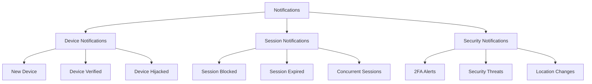

# Notifications System

## Overview

Laravel Devices includes a comprehensive notification system to keep users informed about device and session activities, security events, and system alerts. The package supports multiple notification channels and provides customizable notification templates.

## Notification Types



## Base Notifications

### Device Notifications

```php
class NewDeviceNotification extends Notification implements ShouldQueue
{
    public function __construct(
        private readonly Device $device
    ) {}
    
    public function via($notifiable): array
    {
        return ['mail', 'database'];
    }
    
    public function toMail($notifiable): MailMessage
    {
        return (new MailMessage)
            ->subject(__('devices.notifications.device.new_device.subject'))
            ->greeting(__('devices.notifications.device.new_device.greeting'))
            ->line(__('devices.notifications.device.new_device.line1'))
            ->line(sprintf(
                'Browser: %s %s',
                $this->device->browser,
                $this->device->browser_version
            ))
            ->line(sprintf(
                'Location: %s',
                $this->device->sessions->last()->location->toString()
            ))
            ->action(
                __('devices.notifications.device.new_device.action'),
                route('devices.show', $this->device->uuid)
            )
            ->line(__('devices.notifications.device.new_device.footer'));
    }
    
    public function toDatabase($notifiable): array
    {
        return [
            'device_uuid' => $this->device->uuid,
            'type' => 'new_device',
            'browser' => $this->device->browser,
            'location' => $this->device->sessions->last()->location->toString()
        ];
    }
}
```

### Security Notifications

```php
class DeviceHijackedNotification extends Notification implements ShouldQueue
{
    public function __construct(
        private readonly Device $device,
        private readonly array $securityDetails
    ) {}
    
    public function via($notifiable): array
    {
        // High priority notification
        return ['mail', 'database', 'slack'];
    }
    
    public function toMail($notifiable): MailMessage
    {
        return (new MailMessage)
            ->error()
            ->subject(__('devices.notifications.security.hijacked.subject'))
            ->greeting(__('devices.notifications.security.hijacked.greeting'))
            ->line(__('devices.notifications.security.hijacked.line1'))
            ->line(sprintf(
                'Device: %s %s',
                $this->device->device_family,
                $this->device->device_model
            ))
            ->line(sprintf(
                'Last known location: %s',
                $this->device->sessions->last()->location->toString()
            ))
            ->action(
                __('devices.notifications.security.hijacked.action'),
                route('security.device', $this->device->uuid)
            )
            ->line(__('devices.notifications.security.hijacked.footer'));
    }
    
    public function toSlack($notifiable): SlackMessage
    {
        return (new SlackMessage)
            ->error()
            ->content('Security Alert: Device Hijacked')
            ->attachment(function ($attachment) {
                $attachment
                    ->title('Device Details')
                    ->fields([
                        'Device ID' => $this->device->uuid,
                        'User' => $notifiable->email,
                        'Location' => $this->device->sessions->last()->location->toString(),
                        'Detected At' => now()->toDateTimeString()
                    ]);
            });
    }
}
```

### Session Notifications

```php
class SessionBlockedNotification extends Notification implements ShouldQueue
{
    public function __construct(
        private readonly Session $session,
        private readonly string $reason
    ) {}
    
    public function via($notifiable): array
    {
        return ['mail', 'database'];
    }
    
    public function toMail($notifiable): MailMessage
    {
        return (new MailMessage)
            ->warning()
            ->subject(__('devices.notifications.session.blocked.subject'))
            ->line(__('devices.notifications.session.blocked.line1'))
            ->line(sprintf(
                'Reason: %s',
                $this->reason
            ))
            ->line(sprintf(
                'Location: %s',
                $this->session->location->toString()
            ))
            ->action(
                __('devices.notifications.session.blocked.action'),
                route('sessions.show', $this->session->uuid)
            );
    }
}
```

## Custom Channels

### Push Notification Channel

```php
class PushNotificationChannel
{
    public function send($notifiable, Notification $notification): void
    {
        $message = $notification->toPush($notifiable);
        
        if (empty($message)) {
            return;
        }
        
        $deviceTokens = $notifiable->pushTokens()->pluck('token');
        
        foreach ($deviceTokens as $token) {
            $this->sendPushNotification($token, $message);
        }
    }
    
    private function sendPushNotification(string $token, array $message): void
    {
        // Implementation for your push service (Firebase, APN, etc.)
        $response = Http::post('push-service-url', [
            'token' => $token,
            'title' => $message['title'],
            'body' => $message['body'],
            'data' => $message['data']
        ]);
        
        if (!$response->successful()) {
            Log::error('Push notification failed', [
                'token' => $token,
                'error' => $response->body()
            ]);
        }
    }
}
```

### WebSocket Channel

```php
class WebSocketChannel
{
    public function send($notifiable, Notification $notification): void
    {
        $message = $notification->toWebSocket($notifiable);
        
        if (empty($message)) {
            return;
        }
        
        broadcast(new RealTimeNotification(
            $notifiable->id,
            $message
        ))->toPrivateChannel();
    }
}
```

## Notification Templates

### Email Templates

```php
// resources/views/vendor/notifications/device/new-device.blade.php
@component('mail::message')
# {{ __('devices.notifications.device.new_device.title') }}

{{ __('devices.notifications.device.new_device.greeting', ['name' => $notifiable->name]) }}

{{ __('devices.notifications.device.new_device.line1') }}

**Device Details:**
- Browser: {{ $device->browser }} {{ $device->browser_version }}
- Platform: {{ $device->platform }} {{ $device->platform_version }}
- Location: {{ $device->sessions->last()->location->toString() }}

@component('mail::button', ['url' => $actionUrl])
{{ __('devices.notifications.device.new_device.action') }}
@endcomponent

{{ __('devices.notifications.device.new_device.footer') }}

Thanks,<br>
{{ config('app.name') }}
@endcomponent
```

## Notification Preferences

### User Preferences Model

```php
class NotificationPreferences extends Model
{
    protected $casts = [
        'preferences' => 'array'
    ];
    
    public function user(): BelongsTo
    {
        return $this->belongsTo(User::class);
    }
    
    public function shouldNotify(string $type, string $channel): bool
    {
        return $this->preferences[$type][$channel] ?? true;
    }
    
    public function channels(string $type): array
    {
        return array_filter(
            $this->preferences[$type] ?? [],
            fn($enabled) => $enabled
        );
    }
}
```

### Preference Management

```php
class NotificationPreferenceManager
{
    public function updatePreferences(
        User $user,
        array $preferences
    ): void {
        $user->notificationPreferences()->updateOrCreate(
            ['user_id' => $user->id],
            ['preferences' => $preferences]
        );
    }
    
    public function getDefaultPreferences(): array
    {
        return [
            'new_device' => [
                'mail' => true,
                'database' => true,
                'push' => true
            ],
            'security_alert' => [
                'mail' => true,
                'database' => true,
                'push' => true,
                'slack' => true
            ],
            'session_alert' => [
                'mail' => true,
                'database' => true
            ]
        ];
    }
}
```

## Notification Dispatching

### Notification Dispatcher

```php
class NotificationDispatcher
{
    public function dispatch(
        User $user,
        Notification $notification,
        string $type
    ): void {
        $preferences = $user->notificationPreferences;
        
        if (!$preferences) {
            $user->notify($notification);
            return;
        }
        
        $channels = $preferences->channels($type);
        if (empty($channels)) {
            return;
        }
        
        $notification->via = function () use ($channels) {
            return array_keys($channels);
        };
        
        $user->notify($notification);
    }
}
```

## Testing Notifications

```php
class NotificationTest extends TestCase
{
    /** @test */
    public function it_sends_new_device_notification()
    {
        Notification::fake();
        
        $user = User::factory()->create();
        $device = Device::factory()->create();
        
        $notification = new NewDeviceNotification($device);
        $user->notify($notification);
        
        Notification::assertSentTo(
            $user,
            NewDeviceNotification::class,
            function ($notification) use ($device) {
                return $notification->device->uuid === $device->uuid;
            }
        );
    }
    
    /** @test */
    public function it_respects_user_preferences()
    {
        $user = User::factory()->create();
        $preferences = NotificationPreferences::factory()->create([
            'user_id' => $user->id,
            'preferences' => [
                'new_device' => [
                    'mail' => false,
                    'database' => true
                ]
            ]
        ]);
        
        $device = Device::factory()->create();
        $notification = new NewDeviceNotification($device);
        
        app(NotificationDispatcher::class)->dispatch(
            $user,
            $notification,
            'new_device'
        );
        
        Notification::assertNotSentTo($user, NewDeviceNotification::class, ['mail']);
        Notification::assertSentTo($user, NewDeviceNotification::class, ['database']);
    }
}
```

## Best Practices

1. **Notification Design**
    - Keep notifications concise
    - Provide clear actions
    - Include relevant context
    - Support localization

2. **Channel Selection**
    - Choose appropriate channels
    - Respect user preferences
    - Consider urgency levels
    - Handle channel failures

3. **Performance**
    - Queue notifications
    - Batch when possible
    - Monitor delivery rates
    - Handle failures gracefully

## Next Steps

- Review [API Documentation](api-reference.md)
- Explore [Security Features](security.md)
- Configure [Events](events.md)