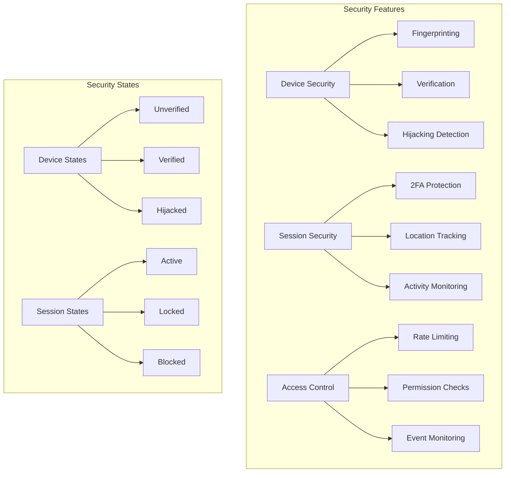

# Security Guide

## Overview

Laravel Devices implements several security features to protect user sessions and devices. This guide covers best practices, security considerations, and implementation patterns for maintaining a secure environment.

## Security Architecture



## Device Security

### Fingerprint Protection

```php
// Example of secure fingerprint handling
class SecureFingerprint
{
    public function validateFingerprint(string $fingerprint, Device $device): bool
    {
        // Verify fingerprint format
        if (!preg_match('/^[a-f0-9]{32}$/', $fingerprint)) {
            Log::warning('Invalid fingerprint format', [
                'fingerprint' => $fingerprint,
                'device' => $device->uuid
            ]);
            return false;
        }
        
        // Check for fingerprint collisions
        $existingDevice = Device::where('fingerprint', $fingerprint)
            ->where('uuid', '!=', $device->uuid)
            ->first();
            
        if ($existingDevice) {
            Log::alert('Fingerprint collision detected', [
                'fingerprint' => $fingerprint,
                'device1' => $device->uuid,
                'device2' => $existingDevice->uuid
            ]);
            return false;
        }
        
        return true;
    }
}
```

### Hijacking Detection

```php
class HijackingDetector
{
    public function detectSuspiciousActivity(Device $device): bool
    {
        return $this->checkLocationChanges($device) ||
            $this->checkBrowserChanges($device) ||
            $this->checkAbnormalActivity($device);
    }
    
    private function checkLocationChanges(Device $device): bool
    {
        $recentSessions = $device->sessions()
            ->orderBy('created_at', 'desc')
            ->take(2)
            ->get();
            
        if ($recentSessions->count() < 2) {
            return false;
        }
        
        $distance = $this->calculateDistance(
            $recentSessions[0]->location,
            $recentSessions[1]->location
        );
        
        $timeDiff = $recentSessions[0]->created_at->diffInHours($recentSessions[1]->created_at);
        
        // Flag if location change is physically impossible
        $maxSpeed = 1000; // km/h
        return ($distance / $timeDiff) > $maxSpeed;
    }
    
    private function checkBrowserChanges(Device $device): bool
    {
        // Implementation
    }
    
    private function checkAbnormalActivity(Device $device): bool
    {
        // Implementation
    }
}
```

## Session Security

### Location-Based Security

```php
class LocationSecurityService
{
    private array $restrictedCountries = ['XX', 'YY'];
    private int $maxDistanceKm = 1000;
    
    public function validateSessionLocation(Session $session): bool
    {
        // Check country restrictions
        if (in_array($session->location->country, $this->restrictedCountries)) {
            $this->logSecurityEvent('restricted_country_access', $session);
            return false;
        }
        
        // Check for suspicious location changes
        if ($this->hasUnexpectedLocationChange($session)) {
            $this->logSecurityEvent('suspicious_location_change', $session);
            return false;
        }
        
        return true;
    }
    
    private function hasUnexpectedLocationChange(Session $session): bool
    {
        $previousSession = $session->user->sessions()
            ->where('id', '!=', $session->id)
            ->orderBy('created_at', 'desc')
            ->first();
            
        if (!$previousSession) {
            return false;
        }
        
        return $this->calculateDistance(
            $session->location,
            $previousSession->location
        ) > $this->maxDistanceKm;
    }
    
    private function logSecurityEvent(string $type, Session $session): void
    {
        SecurityLog::create([
            'type' => $type,
            'session_uuid' => $session->uuid,
            'user_id' => $session->user_id,
            'location' => $session->location,
            'metadata' => [
                'ip' => $session->ip,
                'timestamp' => now()
            ]
        ]);
    }
}
```

### Activity Monitoring

```php
class ActivityMonitor
{
    public function trackActivity(Session $session): void
    {
        $patterns = $this->analyzeActivityPatterns($session);
        
        if ($patterns['suspicious']) {
            $this->handleSuspiciousActivity($session, $patterns);
        }
    }
    
    private function analyzeActivityPatterns(Session $session): array
    {
        return [
            'suspicious' => $this->detectAnomalies($session),
            'rate' => $this->calculateActivityRate($session),
            'locations' => $this->getUniqueLocations($session),
            'timeframes' => $this->analyzeTimeframes($session)
        ];
    }
    
    private function handleSuspiciousActivity(Session $session, array $patterns): void
    {
        // Block session if necessary
        if ($this->shouldBlockSession($patterns)) {
            $session->block();
            
            // Notify user and security team
            $session->user->notify(new SuspiciousActivityNotification($session));
            SecurityTeam::notifyAsync($session, $patterns);
        }
    }
}
```

## Rate Limiting

### API Rate Limiting

```php
// In RouteServiceProvider
protected function configureRateLimiting(): void
{
    RateLimiter::for('2fa', function (Request $request) {
        return Limit::perMinute(5)->by($request->user()?->id);
    });
    
    RateLimiter::for('device-verification', function (Request $request) {
        return Limit::perHour(10)->by($request->user()?->id);
    });
    
    RateLimiter::for('session-operations', function (Request $request) {
        return Limit::perMinute(30)->by($request->user()?->id);
    });
}
```

### Custom Rate Limiter

```php
class SecurityRateLimiter
{
    public function checkLimit(string $key, int $maxAttempts, int $decay): bool
    {
        $attempts = Cache::get($key, 0);
        
        if ($attempts >= $maxAttempts) {
            $this->logExcessiveAttempts($key, $attempts);
            return false;
        }
        
        Cache::put($key, $attempts + 1, now()->addSeconds($decay));
        return true;
    }
    
    public function resetLimit(string $key): void
    {
        Cache::forget($key);
    }
    
    private function logExcessiveAttempts(string $key, int $attempts): void
    {
        Log::warning('Rate limit exceeded', [
            'key' => $key,
            'attempts' => $attempts,
            'ip' => request()->ip(),
            'user_id' => auth()->id()
        ]);
    }
}
```

## Event Monitoring

### Security Event Logger

```php
class SecurityEventLogger
{
    public function logEvent(string $event, array $context = []): void
    {
        $baseContext = [
            'ip' => request()->ip(),
            'user_agent' => request()->userAgent(),
            'timestamp' => now()->toIso8601String(),
            'user_id' => auth()->id()
        ];
        
        Log::channel('security')->info($event, array_merge($baseContext, $context));
    }
}

// Usage in event listeners
class DeviceHijackedListener
{
    public function __construct(private SecurityEventLogger $logger)
    {
    }
    
    public function handle(DeviceHijackedEvent $event): void
    {
        $this->logger->logEvent('device_hijacked', [
            'device_uuid' => $event->device->uuid,
            'location' => $event->device->sessions->last()->location->toString()
        ]);
    }
}
```

## Best Practices

### 1. Session Management

```php
// Implement session security checks
class SessionSecurityManager
{
    public function validateSession(Session $session): bool
    {
        return $this->checkDeviceStatus($session) &&
            $this->validateLocation($session) &&
            $this->checkActivityPatterns($session) &&
            $this->validateTimeframe($session);
    }
    
    public function enforceSecurityPolicies(Session $session): void
    {
        // Implement session duration limits
        if ($session->duration->hours() > 12) {
            $session->end();
        }
        
        // Enforce single session policy if configured
        if (config('devices.allow_device_multi_session') === false) {
            $this->endOtherSessions($session);
        }
        
        // Check inactivity
        if ($session->inactive()) {
            $session->end();
        }
    }
}
```

### 2. Device Verification

```php
class DeviceVerificationManager
{
    public function verifyDevice(Device $device, User $user): bool
    {
        // Implement progressive verification
        $trustScore = $this->calculateTrustScore($device);
        
        if ($trustScore < 50) {
            return false;
        }
        
        if ($trustScore < 80) {
            // Require additional verification
            return $this->requireAdditionalVerification($device, $user);
        }
        
        return true;
    }
    
    private function calculateTrustScore(Device $device): int
    {
        // Implement scoring logic based on:
        // - Device age
        // - Usage patterns
        // - Location consistency
        // - Browser fingerprint stability
        // Implementation...
    }
}
```

### 3. Audit Trail

```php
class SecurityAuditTrail
{
    public function recordAudit(string $action, array $context = []): void
    {
        SecurityAudit::create([
            'action' => $action,
            'user_id' => auth()->id(),
            'ip_address' => request()->ip(),
            'user_agent' => request()->userAgent(),
            'device_uuid' => device_uuid()?->toString(),
            'session_uuid' => session_uuid()?->toString(),
            'context' => $context,
            'timestamp' => now()
        ]);
    }
}
```

## Security Checklist

1. **Device Security**
    - [ ] Implement device fingerprinting
    - [ ] Validate fingerprint uniqueness
    - [ ] Monitor device behavior patterns
    - [ ] Implement device verification process
    - [ ] Set up hijacking detection

2. **Session Security**
    - [ ] Configure session timeouts
    - [ ] Implement location validation
    - [ ] Set up activity monitoring
    - [ ] Configure rate limiting
    - [ ] Implement session locking

3. **2FA Security**
    - [ ] Implement proper rate limiting
    - [ ] Secure secret storage
    - [ ] Implement backup codes
    - [ ] Monitor failed attempts
    - [ ] Implement account recovery

4. **Monitoring & Logging**
    - [ ] Set up security event logging
    - [ ] Implement audit trails
    - [ ] Configure alerting
    - [ ] Monitor suspicious activities
    - [ ] Regular security reviews

## Next Steps

- Review [API Security](api-reference.md)
- Implement [Custom IDs](custom-ids.md)
- Configure [Events System](events.md)