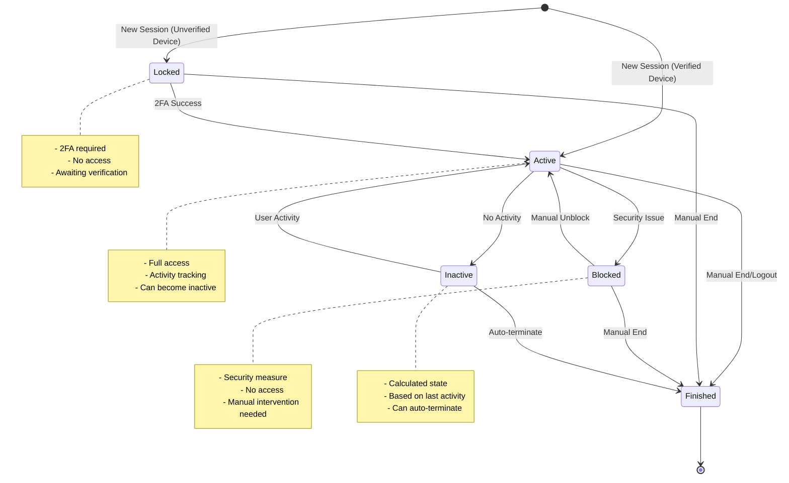
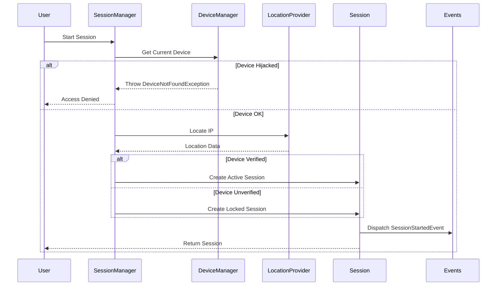

# Session Management

## Overview

Laravel Devices provides comprehensive session management capabilities, including lifecycle management, security controls, and location tracking. Sessions represent active user-device connections and can be locked, blocked, or terminated based on various security criteria.

## Session States and Transitions



## Session Creation Flow



## Basic Session Management

### Starting Sessions

```php
use Ninja\DeviceTracker\Facades\SessionManager;

// Start new session
$session = SessionManager::start();

// Refresh existing session
$session = SessionManager::refresh();

// With custom user
$session = SessionManager::refresh($user);
```

### Session Status Management

```php
// End session
$session->end();

// Block session
$session->block();

// Unblock session
$session->unblock();

// Renew session
$session->renew();

// Check states
if ($session->blocked()) {
    // Session is blocked
}

if ($session->locked()) {
    // Session requires 2FA
}

if ($session->inactive()) {
    // Session is inactive
}

if ($session->finished()) {
    // Session is terminated
}
```

## Location Tracking

### Basic Location Tracking

```php
// Get session location
$location = $session->location;

echo $location->country;    // "ES"
echo $location->city;       // "Madrid"
echo $location->region;     // "Madrid"
echo $location->postal;     // "28004"
echo $location->timezone;   // "Europe/Madrid"
echo $location->latitude;   // "40.4165"
echo $location->longitude;  // "-3.7026"

// Format location
echo $location->toString(); // "28004 Madrid, Madrid, ES"
```

### Location Usage Examples

```php
// Check if session is from same location
public function validateLocation(Session $session): bool
{
    $currentIp = request()->ip();
    $locationProvider = app(LocationProvider::class);
    
    $currentLocation = $locationProvider->locate($currentIp);
    $sessionLocation = $session->location;
    
    return $currentLocation->country === $sessionLocation->country &&
           $currentLocation->region === $sessionLocation->region;
}

// Block sessions from unexpected locations
public function enforceLocationSecurity(Session $session): void
{
    if (!$this->validateLocation($session)) {
        $session->metadata->set('blocked_reason', 'location_change');
        $session->block();
        
        event(new SuspiciousLocationDetected($session));
    }
}
```

## Session Locking with 2FA

### Basic 2FA Flow

```php
// Check if session is locked
if ($session->locked()) {
    // Redirect to 2FA
}

// Verify 2FA code
$controller = app(TwoFactorController::class);
$result = $controller->verify(Request::create('/', 'POST', [
    'code' => '123456'
]));

// Session automatically unlocked on successful 2FA
if ($session->locked()) {
    // 2FA failed
} else {
    // 2FA succeeded
}
```

### Custom 2FA Implementation

```php
// Implement custom 2FA verification
class CustomTwoFactorVerification
{
    public function verify(Session $session, string $code): bool
    {
        // Your verification logic
        $verified = $this->verifyCode($code);
        
        if ($verified) {
            // Unlock session
            $session->unlock();
            
            // Verify device
            $session->device->verify();
            
            // Dispatch event
            event(new Google2FASuccess($session->user));
            
            return true;
        }
        
        event(new Google2FAFailed($session->user));
        return false;
    }
}
```

## Session Inactivity Management

### Configuration

```php
// In config/devices.php
return [
    'inactivity_seconds' => 1200, // 20 minutes
    'inactivity_session_behaviour' => 'terminate', // or 'ignore'
];
```

### Implementation Examples

```php
// Check session activity
if ($session->inactive()) {
    if (config('devices.inactivity_session_behaviour') === 'terminate') {
        // End session
        $session->end();
        
        // Notify user
        event(new SessionTerminatedDueToInactivity($session));
    } else {
        // Just mark as inactive
        Log::info('Session inactive but not terminated', [
            'session_uuid' => $session->uuid
        ]);
    }
}

// Renew session activity
$session->renew();
```

## Multiple Sessions Management

### Configuration

```php
// In config/devices.php
return [
    'allow_device_multi_session' => true,
];
```

### Implementation Examples

```php
// Get all user sessions
$sessions = $user->sessions()->with('device')->get();

// Get active sessions
$activeSessions = $user->sessions()
    ->where('status', SessionStatus::Active)
    ->get();

// End other sessions
public function endOtherSessions(Session $currentSession): void
{
    $user = $currentSession->user;
    
    $user->sessions()
        ->where('uuid', '!=', $currentSession->uuid)
        ->whereNull('finished_at')
        ->each(function ($session) {
            $session->end();
        });
}
```

## Session Events

```php
// Available events
use Ninja\DeviceTracker\Events\SessionStartedEvent;
use Ninja\DeviceTracker\Events\SessionFinishedEvent;
use Ninja\DeviceTracker\Events\SessionBlockedEvent;
use Ninja\DeviceTracker\Events\SessionUnblockedEvent;
use Ninja\DeviceTracker\Events\SessionLockedEvent;
use Ninja\DeviceTracker\Events\SessionUnlockedEvent;

// Example listeners
protected $listen = [
    SessionStartedEvent::class => [
        LogSessionStart::class,
        NotifyUserOfNewSession::class,
    ],
    SessionBlockedEvent::class => [
        NotifyUserOfBlockedSession::class,
        AlertSecurityTeam::class,
    ],
];
```

## Best Practices

1. **Session Security**

```php
// Implement session security checks
public function validateSession(Session $session): bool
{
    // Check location
    if (!$this->validateLocation($session)) {
        return false;
    }
    
    // Check device status
    if ($session->device->hijacked()) {
        return false;
    }
    
    // Check inactivity
    if ($session->inactive()) {
        return false;
    }
    
    return true;
}
```

2. **Session Cleanup**

```php
// Regular session cleanup
public function cleanupSessions(): void
{
    // End inactive sessions
    Session::query()
        ->whereNull('finished_at')
        ->where('last_activity_at', '<', now()->subHours(24))
        ->each(function ($session) {
            $session->end();
        });
}
```

3. **Session Monitoring**

```php
// Monitor session activity
public function monitorSession(Session $session): void
{
    // Track session metrics
    $metrics = [
        'duration' => $session->started_at->diffInMinutes(now()),
        'location' => $session->location->toString(),
        'device' => $session->device->label(),
        'status' => $session->status
    ];
    
    // Log metrics
    Log::info('Session metrics', $metrics);
    
    // Check for anomalies
    if ($this->detectAnomalies($metrics)) {
        event(new SessionAnomalyDetected($session, $metrics));
    }
}
```

## Next Steps

- Learn about [Device Fingerprinting](fingerprinting.md)
- Configure [Two-Factor Authentication](2fa.md)
- Explore [API Reference](api-reference.md)