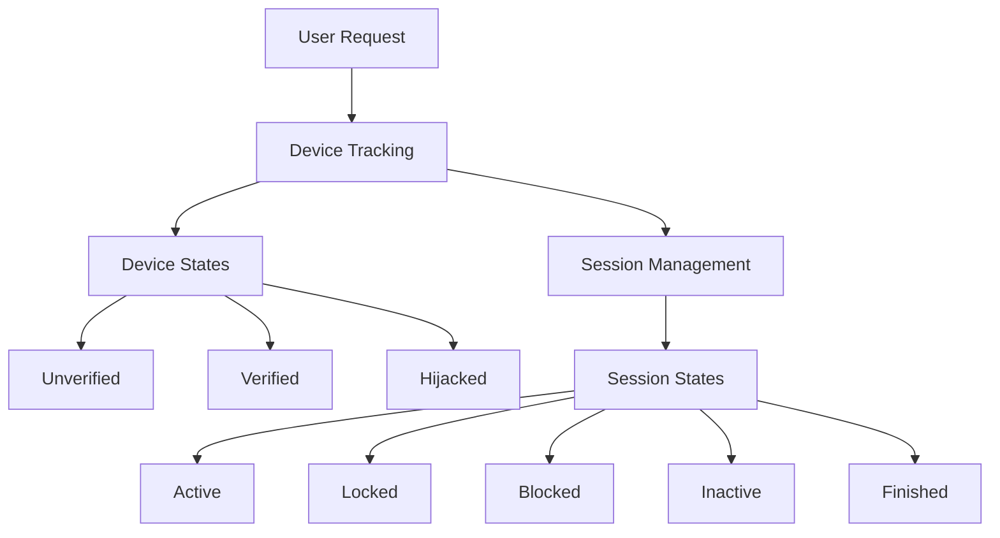
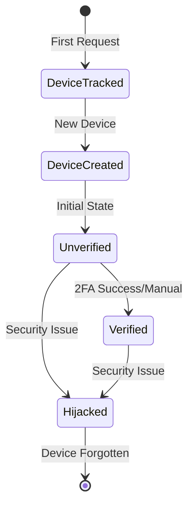
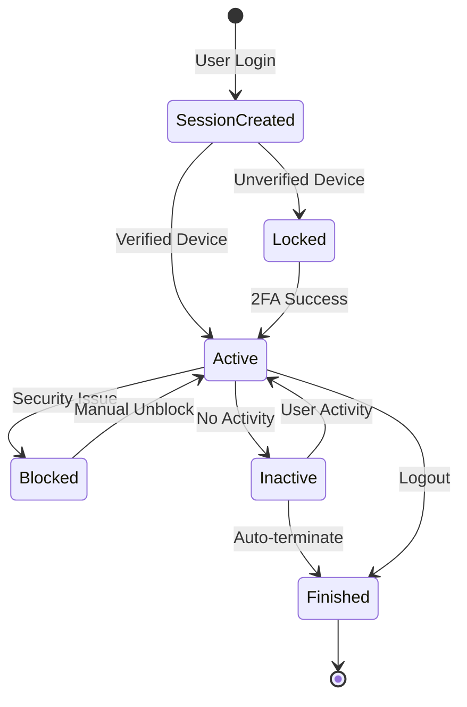

# System Overview

This package tracks user devices and sessions. It requires a current Laravel session to be active to work properly, so you need to start a session before using it, this is achieved by adding the StartSession middleware before the SessionTracker one.



## Devices

Devices represent physical or virtual endpoints that users use to access your application. Each device is uniquely identified and can maintain multiple sessions. Devices go through various states during their lifecycle:

- **Unverified**: Initial state when a device is first detected
- **Verified**: Device has been confirmed as trusted through 2FA or manual verification
- **Hijacked**: Device has been flagged as compromised and is blocked from creating new sessions

Devices store detailed information about the client including:
- Browser details (name, version, engine)
- Platform information (OS, version)
- Device characteristics (type, model)
- Fingerprint (when enabled)
- Location data (through sessions)

### Device State Flow



### Tracking

When a user accesses a route with DeviceTracker middleware enabled, the middleware checks for the presence of a cookie (devices.device_id_cookie_name), if the cookie is already set, the middleware does nothing, if not, the middleware generates a new configured uuid, created a new Device, sets the cookie and forwards the request. The DeviceCreated and DeviceTracked events are fired after setting the cookie to the user.

### Attaching

When a user logs in to the application, the AuthenticationHandler listening to the Login auth event, checks for the presence of the device uuid, either in application memory if this is the first time the device is tracked, or in the cookie in subsequent requests. If the device uuid is available, it retrieves the current device and attaches it to the logged user. The new device is flagged as unverified for the user. The DeviceAttached event is fired after this action.

### Fingerprinting

Device fingerprinting provides an additional layer of device identification beyond the basic UUID tracking. The package supports two fingerprinting libraries:

1. **FingerprintJS** (default):
    - Provides advanced browser fingerprinting
    - Uses multiple signals to generate a unique identifier
    - Requires a paid license for production use
    - More accurate and stable fingerprints

2. **ClientJS**:
    - Open-source alternative
    - Simpler fingerprinting algorithm
    - Completely free to use
    - Lighter weight implementation

The fingerprinting process is handled by the `FingerprintTracker` middleware, which:
- Injects the appropriate fingerprinting script
- Captures the generated fingerprint via header or cookie
- Associates the fingerprint with the device
- Provides consistency checking across sessions

Fingerprints can be used to:
- Detect suspicious device changes
- Enhance device identification accuracy
- Support device verification decisions
- Aid in hijacking detection

### Verifying

The initial status for a device is unverified, this means the device has been created but we don't have any valid user interaction from the user verifying the device, by default we don't consider the user login sufficient to verify the device. A device can be verified in two main ways, either by unlocking a session using a 2FA method, or by the user marking the device as verified using the controller action. The DeviceVerified event is fired when a device is flagged as verified for a user.

By default while a device is unverified, all the sessions from that device will be created in a locked state if the 2FA is enabled, both globally and for the logged user, and will be need to unlock to be able to use the api from that session.

### Hijacking

A device can be flagged as hijacked at any time, now by controller and model, and in the near future with an automatic mechanism (WIP) to detect possible device or session hijacking attempts. This is a work in progress. A hijacked device can no longer create sessions. When a device is flagged as hijacked, the DeviceHijacked event is fired and all sessions associated with the device are blocked. At the moment, the hijacked state is a final state, this mean that flagging a device as hijacked is a non-back operation, there isn't a way to set back the device as verified.

## Sessions

Every time a user logs in to the application, the AuthenticationHandler, attaches the current tracked device to the logged user and tries to start a session, it checks if there is an active session already started, if so it renews the session, setting the last_activity_at in the model.

If there is no active session for that user and device, it creates a new one. If the device creating the session is verified, the session is created with status active, if the device is flagged as unverified, the session is created with status locked and must be unlocked in a further step. This is the default behavior but can be changed using the configuration file.

The SessionStarted event is dispatched after the session is created.

### Session State Flow



### Session Location

Every time a new session is created, the ip address location is tracked and the geographical information is added to the session. You can develop your own LocationProviders implementing the LocationProvider contract. An IpInfo location provider is configured and used by default.

IP address location resolutions are suitable to be cached. You can configure cache in the [config file](https://github.com/diego-ninja/laravel-devices/blob/6e3373936cbe3ba9e9c24c97fa29b8798ec23992/config/devices.php).

The following information is stored associated to the session, you can use this information to detect hijacking attempts, or at least notify the user about suspicious activity if the session initial location differs a lot from request location.

```json
{
  "ip": "2.153.101.169",
  "hostname": "2.153.101.169.dyn.user.ono.com",
  "country": "ES",
  "region": "Madrid",
  "city": "Madrid",
  "postal": "28004",
  "latitude": "40.4165",
  "longitude": "-3.7026",
  "timezone": "Europe/Madrid",
  "label": "28004 Madrid, Madrid, ES"
}
```

### Locking

A session is locked if started from an unverified device, meaning that the user must unlock the session in order to interact with the application. This module provides out-of-the-box integration with Google 2FA authentication, which uses authenticator codes to unlock sessions.

Once a session is unlocked with an authenticator code, the device that owns the session is marked as verified and will no longer ask for 2FA for the sessions it creates. It will create active sessions.

Locked sessions cannot be unlocked using the supplied controller, so if you need another mechanism to artificially unlock sessions, you should implement it.

#### Google 2FA Support

This module provides out-of-the-box integration with Google 2FA via Authenticator codes, a controller is provided, this controller needs an authenticated user to work. A successful code verification attempt will unlock the current session and set the underlying device as verified. If you need to change this behavior, you should not use the provided controller and implement your own.

You can integrate another 2FA solution and use its events to notify this module of successful and failed attempts. You should send a `Ninja\DeviceTracker\Events\Google2FASuccess` with the Authenticatable instance as payload when a successful attempt is made. A listener for this event will be set and the current session and device will be unlocked and verified for the user.

### Blocking

A session can be blocked via two mechanism, calling the Sessions controller and manually blocking a suspicious session by the user or, when a device is flagged as hijacked by the application, all their sessions are blocked. When a session is blocked the event SessionBlocked is dispatched. The SessionTracker middleware will return a 401 Unauthorized response when detecting a blocked session.

Blocked sessions only can be set to active again, unblock session, using the Sessions controller.

### Inactive Sessions

A session becomes inactive when a number of seconds, defined in the configuration file, has passed without interaction between the logged on user and the application, the session is considered inactive, the inactive status is a calculated status, not a static one, it is calculated using the inactive() method of the Session model.

You can just let the inactive sessions exist without taking any action and wait for an external source to terminate them, the front application or a background process, or use the option in the configuration file to automatically terminate the inactive sessions when the SessionTracker middleware detects them.

### Session Termination

When a user logs out of the application, the AuthenticationHandler listening on the Logout auth event sets the session status to finished and the finished_at to the current date and time.

If the option to automatically log out inactive sessions is set in the configuration file, the SessionTracker middleware will terminate the current session when it becomes inactive.

The finished state is a final state, this means that finishing a session is a non-return operation, there's no way to return the session to active.