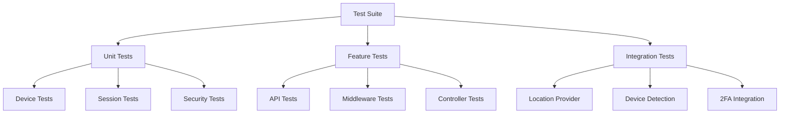

# Testing Guide

## Overview

This guide covers testing strategies, test types, and best practices for testing Laravel Devices implementations. It includes examples for unit tests, integration tests, and feature tests.

## Test Structure



## Test Setup

### Base Test Case

```php
namespace Tests;

use Illuminate\Foundation\Testing\RefreshDatabase;
use Ninja\DeviceTracker\Tests\TestCase as BaseTestCase;

abstract class DeviceTestCase extends BaseTestCase
{
    use RefreshDatabase;
    
    protected function setUp(): void
    {
        parent::setUp();
        
        // Mock external services
        $this->mockLocationProvider();
        $this->mockDeviceDetector();
        
        // Set up test data
        $this->setUpTestData();
    }
    
    protected function mockLocationProvider(): void
    {
        $this->mock(LocationProvider::class)
            ->shouldReceive('locate')
            ->andReturn(new Location([
                'country' => 'US',
                'region' => 'California',
                'city' => 'San Francisco',
                'postal' => '94105',
                'latitude' => '37.7749',
                'longitude' => '-122.4194',
                'timezone' => 'America/Los_Angeles'
            ]));
    }
    
    protected function mockDeviceDetector(): void
    {
        $this->mock(DeviceDetector::class)
            ->shouldReceive('detect')
            ->andReturn(new Device(/* test data */));
    }
}
```

## Unit Tests

### Device Tests

```php
namespace Tests\Unit;

use Tests\DeviceTestCase;
use Ninja\DeviceTracker\Models\Device;
use Ninja\DeviceTracker\Enums\DeviceStatus;

class DeviceTest extends DeviceTestCase
{
    /** @test */
    public function it_creates_device_with_valid_data(): void
    {
        $device = Device::factory()->create([
            'status' => DeviceStatus::Unverified
        ]);
        
        $this->assertDatabaseHas('devices', [
            'uuid' => $device->uuid,
            'status' => DeviceStatus::Unverified->value
        ]);
    }
    
    /** @test */
    public function it_verifies_device_correctly(): void
    {
        $device = Device::factory()->create([
            'status' => DeviceStatus::Unverified
        ]);
        
        $device->verify();
        
        $this->assertEquals(DeviceStatus::Verified, $device->status);
        $this->assertNotNull($device->verified_at);
    }
    
    /** @test */
    public function it_handles_device_hijacking(): void
    {
        $device = Device::factory()->create([
            'status' => DeviceStatus::Verified
        ]);
        
        $device->hijack();
        
        $this->assertEquals(DeviceStatus::Hijacked, $device->status);
        $this->assertNotNull($device->hijacked_at);
        
        // Test that sessions are blocked
        $this->assertTrue($device->sessions->every->blocked());
    }
}
```

### Session Tests

```php
namespace Tests\Unit;

use Tests\DeviceTestCase;
use Ninja\DeviceTracker\Models\Session;
use Ninja\DeviceTracker\Enums\SessionStatus;

class SessionTest extends DeviceTestCase
{
    /** @test */
    public function it_creates_session_correctly(): void
    {
        $device = Device::factory()->create();
        $user = User::factory()->create();
        
        $session = Session::start($device, $user);
        
        $this->assertDatabaseHas('device_sessions', [
            'uuid' => $session->uuid,
            'user_id' => $user->id,
            'device_uuid' => $device->uuid
        ]);
    }
    
    /** @test */
    public function it_handles_session_blocking(): void
    {
        $session = Session::factory()->create([
            'status' => SessionStatus::Active
        ]);
        
        $session->block();
        
        $this->assertEquals(SessionStatus::Blocked, $session->status);
        $this->assertNotNull($session->blocked_at);
    }
    
    /** @test */
    public function it_detects_inactive_sessions(): void
    {
        $session = Session::factory()->create([
            'last_activity_at' => now()->subMinutes(30)
        ]);
        
        $this->assertTrue($session->inactive());
    }
}
```

## Feature Tests

### API Tests

```php
namespace Tests\Feature;

use Tests\DeviceTestCase;

class DeviceApiTest extends DeviceTestCase
{
    /** @test */
    public function it_lists_user_devices(): void
    {
        $user = User::factory()->create();
        $devices = Device::factory()->count(3)->create();
        
        $user->devices()->attach($devices);
        
        $response = $this->actingAs($user)
            ->getJson('/api/devices');
            
        $response->assertStatus(200)
            ->assertJsonCount(3, 'data')
            ->assertJsonStructure([
                'data' => [
                    '*' => [
                        'uuid',
                        'status',
                        'browser',
                        'platform',
                        'device'
                    ]
                ]
            ]);
    }
    
    /** @test */
    public function it_verifies_device(): void
    {
        $user = User::factory()->create();
        $device = Device::factory()->create([
            'status' => DeviceStatus::Unverified
        ]);
        
        $user->devices()->attach($device);
        
        $response = $this->actingAs($user)
            ->patchJson("/api/devices/{$device->uuid}/verify");
            
        $response->assertStatus(200);
        
        $this->assertEquals(
            DeviceStatus::Verified,
            $device->fresh()->status
        );
    }
}
```

### Middleware Tests

```php
namespace Tests\Feature;

use Tests\DeviceTestCase;

class MiddlewareTest extends DeviceTestCase
{
    /** @test */
    public function session_tracker_blocks_inactive_sessions(): void
    {
        $user = User::factory()->create();
        $session = Session::factory()->create([
            'user_id' => $user->id,
            'last_activity_at' => now()->subHours(2)
        ]);
        
        config(['devices.inactivity_seconds' => 3600]); // 1 hour
        
        $response = $this->actingAs($user)
            ->withSession(['device_session_id' => $session->uuid])
            ->getJson('/api/protected-route');
            
        $response->assertStatus(401);
    }
    
    /** @test */
    public function fingerprint_tracker_injects_script(): void
    {
        $response = $this->get('/');
        
        $response->assertStatus(200)
            ->assertSee('FingerprintJS')
            ->assertSee('window.DeviceTracker');
    }
}
```

## Integration Tests

### External Service Integration

```php
namespace Tests\Integration;

use Tests\DeviceTestCase;

class LocationProviderTest extends DeviceTestCase
{
    protected function setUp(): void
    {
        parent::setUp();
        
        // Use real location provider for integration tests
        $this->app->instance(
            LocationProvider::class,
            new IpinfoLocationProvider()
        );
    }
    
    /** @test */
    public function it_resolves_real_ip_addresses(): void
    {
        $provider = app(LocationProvider::class);
        $location = $provider->locate('8.8.8.8');
        
        $this->assertNotNull($location->country);
        $this->assertNotNull($location->city);
        $this->assertNotNull($location->latitude);
        $this->assertNotNull($location->longitude);
    }
}
```

## Performance Tests

```php
namespace Tests\Performance;

use Tests\DeviceTestCase;

class PerformanceTest extends DeviceTestCase
{
    /** @test */
    public function it_handles_concurrent_device_tracking(): void
    {
        $startTime = microtime(true);
        
        parallel(function () {
            for ($i = 0; $i < 100; $i++) {
                DeviceManager::track();
            }
        }, 10); // 10 concurrent processes
        
        $endTime = microtime(true);
        $duration = $endTime - $startTime;
        
        $this->assertLessThan(5, $duration); // Should complete in < 5 seconds
    }
    
    /** @test */
    public function it_efficiently_queries_devices(): void
    {
        Device::factory()->count(1000)->create();
        
        $queries = 0;
        DB::listen(function () use (&$queries) {
            $queries++;
        });
        
        $devices = Device::with('sessions')
            ->whereHas('sessions', function ($query) {
                $query->where('status', SessionStatus::Active);
            })
            ->get();
            
        $this->assertLessThan(3, $queries); // Should use <= 2 queries
    }
}
```

## Test Data Factories

```php
namespace Database\Factories;

use Illuminate\Database\Eloquent\Factories\Factory;
use Ninja\DeviceTracker\Models\Device;
use Ninja\DeviceTracker\Enums\DeviceStatus;

class DeviceFactory extends Factory
{
    protected $model = Device::class;
    
    public function definition(): array
    {
        return [
            'uuid' => $this->faker->uuid,
            'fingerprint' => md5($this->faker->unique()->text),
            'status' => $this->faker->randomElement(DeviceStatus::cases()),
            'browser' => 'Chrome',
            'browser_version' => '118.0.0',
            'platform' => 'Windows',
            'platform_version' => '10.0',
            'device_type' => 'desktop',
            'ip' => $this->faker->ipv4
        ];
    }
    
    public function verified(): self
    {
        return $this->state(function () {
            return [
                'status' => DeviceStatus::Verified,
                'verified_at' => now()
            ];
        });
    }
    
    public function hijacked(): self
    {
        return $this->state(function () {
            return [
                'status' => DeviceStatus::Hijacked,
                'hijacked_at' => now()
            ];
        });
    }
}
```

## Github Actions Workflow

```yaml
name: Tests

on: [push, pull_request]

jobs:
  test:
    runs-on: ubuntu-latest
    
    services:
      redis:
        image: redis
        ports:
          - 6379:6379
          
    steps:
      - uses: actions/checkout@v2
      
      - name: Setup PHP
        uses: shivammathur/setup-php@v2
        with:
          php-version: '8.2'
          extensions: redis
          coverage: xdebug
          
      - name: Install Dependencies
        run: composer install -q --no-ansi --no-interaction --no-scripts --no-progress --prefer-dist
        
      - name: Execute Tests
        run: vendor/bin/pest --coverage
        env:
          REDIS_HOST: localhost
          
      - name: Upload Coverage
        uses: codecov/codecov-action@v2
```

## Best Practices

1. **Test Organization**
    - Group tests logically
    - Use descriptive test names
    - Follow naming conventions
    - Maintain test independence

2. **Test Data**
    - Use factories for test data
    - Avoid hard-coded values
    - Clean up test data
    - Use realistic test scenarios

3. **Mocking**
    - Mock external services
    - Use fake implementations
    - Test edge cases
    - Verify mock interactions

4. **Performance**
    - Test with realistic data volumes
    - Monitor test execution time
    - Use database transactions
    - Implement parallel testing

## Next Steps

- Review [API Documentation](api-reference.md)
- Explore [Security Features](security.md)
- Configure [Monitoring](monitoring-performance.md)